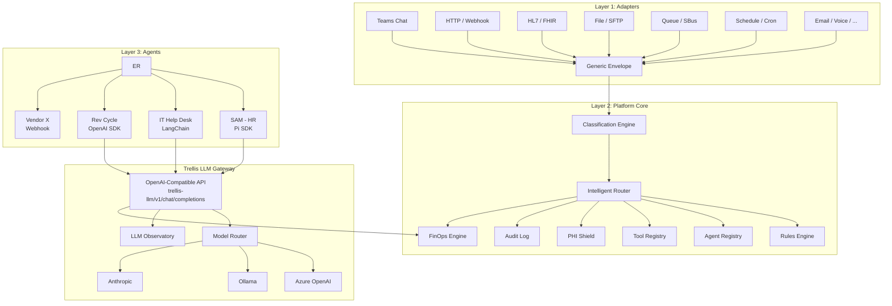
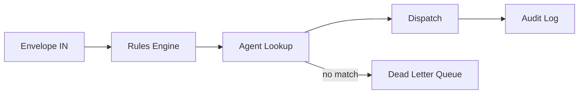
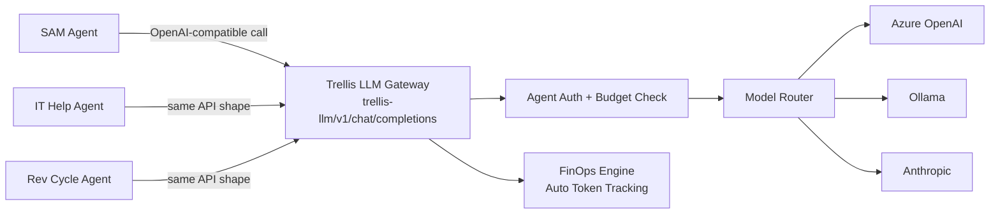
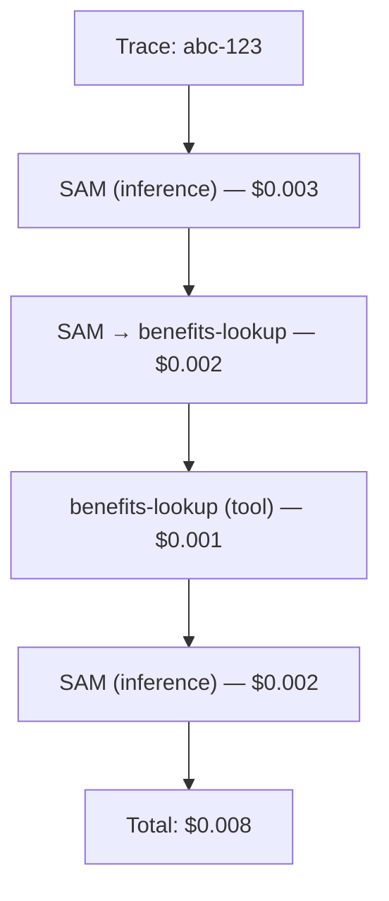
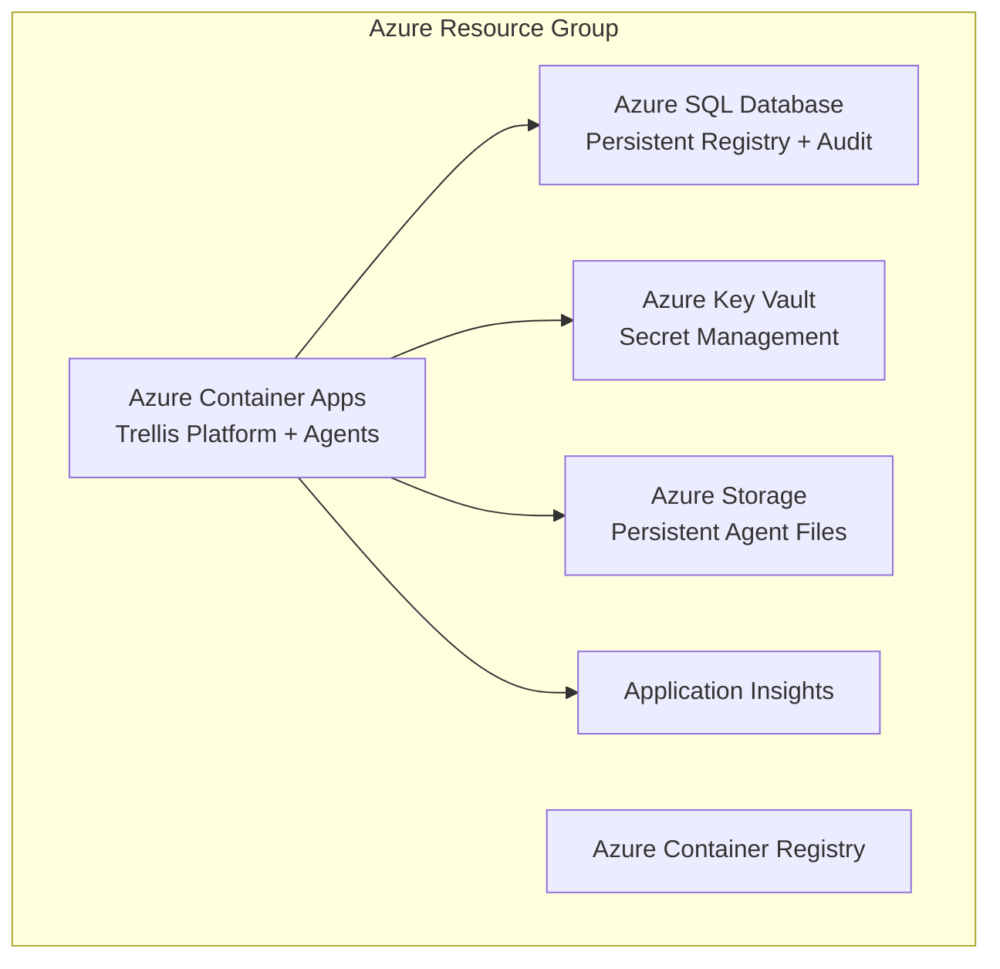

# Trellis — Enterprise AI Agent Orchestration

**Date:** 2026-02-22 (updated 2026-03-27)
**Status:** v1.0 evolution in progress. 623 tests passing.
**Owner:** Eric O'Brien, SVP Enterprise Technology
**One-liner:** Kubernetes for AI agents — manage, route, and govern hundreds of agents across a healthcare system. Every agent is an LLM agent. Differentiated by configuration, not code.

---

## Executive Summary (BLUF)

Health First needs a platform that manages AI agents the way Kubernetes manages containers: deploy them, route work to them, track their costs, and audit every action — without caring what framework they run on. Today we have one agent (SAM, HR) built on Pi SDK. Tomorrow we'll have dozens across HR, Revenue Cycle, IT, Clinical, and Supply Chain. This architecture defines a three-layer system — adapters that normalize any input into a generic envelope, a platform core that routes and governs, and agents that do the actual work. The platform is Azure-native, HIPAA-ready, and designed so that a Pi SDK agent, an OpenAI Assistants agent, and a vendor black-box can all coexist under the same governance model. We chose a hybrid approach (Shape C) that gives managed agents free FinOps and model routing while letting external agents bring their own inference. The result: one dashboard, one audit trail, one cost model for every AI agent in the enterprise.

---

## Three-Layer Architecture



### Layer 1: Adapters (Edges)

Dumb translators. Each adapter knows one protocol and converts it into a generic envelope. No business logic, no routing decisions, no state. An adapter's entire job: receive input → build envelope → POST to event router.

Adapters are infrastructure. The platform team owns all of them.

Supported input types:
- **Teams chat** — human messages via Bot Framework webhook
- **HTTP/webhook** — system-to-agent calls, manual triggers
- **HL7/FHIR** — Epic events via Azure Health Data Services
- **File/SFTP** — blob drops, flat file triggers
- **Message queue** — Azure Service Bus, Kafka consumers
- **Database/CDC** — change data capture, new row triggers
- **Schedule/cron** — time-based triggers via Azure Functions timer
- **Log stream** — Sentinel, LogicMonitor alerts
- **Form submission** — ServiceNow/Ivanti ticket creation
- **Voice** — 8x8 call transcription → text
- **Email** — mailbox monitoring via Graph API
- **Document** — PDF, DOCX, TXT, CSV, Markdown uploads → chunked text envelopes
- **Agent-to-agent** — internal delegation (just another envelope)

### Layer 2: Platform Core

The brain. Receives envelopes, decides where they go, enforces governance, tracks costs, logs everything. Detailed in [Platform Core Components](#platform-core-components).

### Layer 3: Agents (Workers)

Do the actual work. In v1.0, **every agent is an LLM agent** — a system prompt + tool permissions + model config, executed by the platform's AgentLoop runtime. No custom code, no external processes, no container-per-agent. See [Agent Model (v1.0)](#agent-model-v10) for the full design.

Agents use the **Trellis LLM Gateway** for all inference. The gateway provides cost tracking, model routing, rate limiting, and budget enforcement — all transparent to the agent. The AgentLoop calls the gateway internally; agents don't manage their own LLM connections.

External/vendor HTTP agents are the exception — they run as independent services and POST results back. They self-report costs with anomaly monitoring and budget caps.

---

## Generic Envelope Spec

Every input, regardless of source, becomes this:

```json
{
  "envelope_id": "uuid",
  "source_type": "teams|api|file|queue|schedule|hl7|log|form|voice|agent|manual",
  "source_id": "identifier for the specific source instance",
  "payload": {
    "text": "optional — human message or parsed content",
    "data": {},
    "attachments": []
  },
  "metadata": {
    "trace_id": "uuid — links entire event chain",
    "timestamp": "ISO-8601",
    "priority": "low|normal|high|critical",
    "sender": {
      "id": "azure-ad-oid or system identifier",
      "name": "display name",
      "department": "HR|IT|RevCycle|...",
      "roles": ["manager", "clinician", "admin"]
    }
  },
  "routing_hints": {
    "agent_id": "optional — direct routing bypass",
    "department": "optional — route to department's default agent",
    "category": "optional — semantic category for rules engine",
    "tags": []
  }
}
```

**Field notes:**
- `trace_id` is the single most important field. When Agent A delegates to Agent B, both envelopes share a `trace_id`. This is how we get end-to-end cost traces and audit chains.
- `source_type` + `source_id` together identify exactly which adapter instance produced the envelope. Useful for debugging and rate limiting.
- `routing_hints` are suggestions, not commands. The rules engine can override them. `agent_id` bypasses the rules engine only if the caller has direct-route permission.
- `payload.data` is unstructured. An HL7 adapter puts parsed FHIR resources here. A Teams adapter puts conversation context. The agent knows what to expect based on `source_type`.

---

## Platform Core Components

### Event Router

Receives envelopes from adapters via HTTP POST. Applies the rules engine to determine the target agent(s). Dispatches the envelope to the selected agent's registered endpoint. Handles fan-out (one event → multiple agents) and dead-letter (no matching rule → quarantine queue).



The router is stateless. It doesn't queue — it dispatches synchronously or fires-and-forgets to the agent's endpoint. If we need guaranteed delivery, Azure Service Bus sits between the router and the agent.

### Rules Engine

Pre-dispatch governance. Rules are data, stored in the database, editable via dashboard. A rule is:

```json
{
  "rule_id": "uuid",
  "name": "Epic ADT events to bed management agent",
  "priority": 100,
  "conditions": {
    "source_type": "hl7",
    "payload.data.event_type": "ADT^A01",
    "metadata.priority": { "$in": ["high", "critical"] }
  },
  "actions": {
    "route_to": "agent-bed-mgmt",
    "set_priority": "critical",
    "require_approval": false
  },
  "active": true
}
```

Rules evaluate top-down by priority. First match wins (unless fan-out is configured). Conditions use a simple JSON query syntax — no code, no DSL to learn. Complex routing logic means you need more rules, not a smarter engine.

### Agent Registry

Every agent in the enterprise is registered here. Registration is the gate — no registration, no traffic.

```json
{
  "agent_id": "sam-hr",
  "name": "SAM — HR Operations Agent",
  "owner": "Jane Smith",
  "department": "HR",
  "framework": "pi-sdk",
  "endpoint": "https://sam-hr.azurecontainerapps.io/envelope",
  "health_endpoint": "https://sam-hr.azurecontainerapps.io/health",
  "tools": ["peoplesoft-lookup", "ukg-schedule", "email-send"],
  "channels": ["teams", "api"],
  "maturity": "assisted",
  "cost_mode": "managed",
  "created": "2026-02-22T00:00:00Z",
  "last_health_check": "2026-02-22T21:00:00Z",
  "status": "healthy"
}
```

**Maturity levels:** `shadow` → `assisted` → `autonomous`. Shadow agents execute but a human reviews before the result is delivered. Assisted agents deliver results but flag uncertainty for human review. Autonomous agents operate independently. The platform enforces these — not the agent.

### Tool Registry

Tools exist independently of agents. A tool is a capability: "look up an employee in PeopleSoft," "send an email," "query Epic FHIR endpoint." Tools have schemas (input/output), endpoints, and permission policies.

```json
{
  "tool_id": "peoplesoft-lookup",
  "name": "PeopleSoft Employee Lookup",
  "description": "Query HCM for employee records by ID or name",
  "schema": { "input": { "employee_id": "string" }, "output": { "record": "object" } },
  "endpoint": "https://tools.hf.internal/peoplesoft/lookup",
  "phi": true,
  "allowed_agents": ["sam-hr", "hr-onboarding"],
  "rate_limit": "100/hour"
}
```

Agents don't discover tools — they're assigned tools via policy. The CISO office reviews any tool marked `phi: true` before it goes live.

### LLM Gateway

**The critical infrastructure component.** The gateway is an OpenAI-compatible API endpoint (`/v1/chat/completions`) that agents use instead of calling LLM providers directly. Agents point their SDK's `base_url` at the gateway — no code changes needed, any framework that speaks OpenAI API works.

**Why this matters:** This is how Trellis gets full visibility without stripping agents of autonomy. The agent still owns its logic — what to ask, when to chain tools, how to reason. The gateway controls *which model answers* and *tracks every token*.

The gateway provides:

- **Model routing** — route to the cheapest model that can handle the task complexity (see FinOps). Agent can request a model, or let Trellis pick.
- **Cost tracking** — every token counted, attributed to agent + trace. Automatic. No self-reporting needed.
- **Rate limiting** — per-agent, per-department quotas and budget caps.
- **Hot-swap** — change the backing model for any agent without touching the agent. SAM runs on GPT-4o today, Ollama tomorrow — one config change.
- **Fallback chains** — primary model fails → try secondary → try local Ollama.
- **Agent authentication** — agents call the gateway with a Trellis-issued API key. Gateway knows which agent is calling, applies that agent's model policy and budget.
- **Tool call passthrough** — the gateway proxies tool/function calls transparently. LLM returns a tool call → gateway passes it back to the agent. Agent executes the tool using its own identity. Gateway logs the full conversation (prompt → tool call → tool result → response) for audit without intercepting execution.



External/vendor agents that cannot point at the gateway self-report costs. They get budget caps and anomaly monitoring but not the full visibility of managed agents. This is the exception path, not the default.

### FinOps Engine

Every inference call, every tool invocation, every agent execution has a cost. The FinOps engine tracks it all.

Cost dimensions:
- **Per agent** — "SAM cost $47 this month"
- **Per query** — "This HR lookup cost $0.003"
- **Per department** — "HR agents cost $200/month total"
- **Per trace** — "This one Epic event triggered 3 agents and cost $0.15 end-to-end"

Data model:

```json
{
  "cost_event_id": "uuid",
  "trace_id": "links to envelope trace",
  "agent_id": "sam-hr",
  "department": "HR",
  "event_type": "llm_inference|tool_call|agent_execution",
  "model": "gpt-4o-mini",
  "tokens_in": 1200,
  "tokens_out": 350,
  "cost_usd": 0.002,
  "timestamp": "ISO-8601"
}
```

### Classification Engine

**Status:** Implemented (`trellis/classification.py`, 51 tests)

Auto-classifies every inbound envelope before routing. Enriches envelopes with department, category, severity, and entity tags without requiring senders to understand Trellis's routing structure.

**Classification pipeline:**
1. **Source-type mapping** — known sources (e.g., `epic` → Clinical, `ukg` → HR) get high-confidence classification
2. **Keyword analysis** — scans payload text and data for domain-specific keywords (security, clinical, HR, revenue, compliance)
3. **Severity inference** — CVSS scores ≥9, exploit flags, outage/breach/ransomware keywords trigger critical severity; escalation keywords trigger high
4. **Tag extraction** — CVE IDs, tech stack systems, payer names, denial codes extracted as structured tags
5. **Merge** — sender-provided hints take priority; inferred values fill gaps

### Intelligent Router

**Status:** Implemented (`trellis/intelligent_router.py`, 60+ tests)

Replaces static rule matching with multi-dimensional scoring. Agents declare what they handle via intake declarations; the router scores every envelope against every declared agent.

**5 scoring dimensions:**
- Category affinity (30%) — hierarchical dot-notation matching with parent/child scoring
- Source type (25%) — exact match on declared source types
- Keyword overlap (20%) — Jaccard similarity with CVE bonus scoring
- System match (15%) — technology stack alignment
- Priority alignment (10%) — priority range matching

**Additional multipliers:**
- **Historical multiplier** [0.70–1.30] — per-agent, per-category success rate via EMA (α=0.15)
- **Load multiplier** — penalizes agents above 50% in-flight capacity, zeros at 100%

**Routing modes:** `shadow` (log scores alongside rules), `hybrid` (scored with rule fallback), `scored` (full intelligent routing)

**Feedback loop:** Agents submit outcome feedback (success/failure/partial). Daily weight updater adjusts dimension weights based on which dimensions best predicted success.

### PHI Shield

**Status:** Implemented (`trellis/phi_shield.py`, 30+ tests)

HIPAA-compliant PHI/PII detection and redaction integrated into the LLM Gateway pipeline.

- **18 HIPAA Safe Harbor identifiers** plus healthcare-specific types: MRN, NPI, ICD-10, CPT, Health Plan ID, Device ID, Account Number
- **Dual detection:** regex patterns for structured data + Presidio NLP for unstructured names and addresses
- **Per-agent modes:** `full` (redact → LLM → rehydrate), `redact_only`, `audit_only`, `off`
- **Ephemeral token vault:** PHI mapped to reversible tokens in memory; never persisted, never logged
- **False-positive suppression:** drug names and facility names filtered from Presidio PERSON detections

### LLM Observatory

**Status:** Implemented (`trellis/observatory.py`, 16 tests)

Per-model performance tracking for all inference calls through the LLM Gateway.

- Model-level metrics: request count, total tokens, latency (avg, p50, p95), error count, cost
- Hourly breakdown for trend analysis
- Multi-agent aggregation (same model used by different agents)
- Token efficiency metrics (output/input ratio)
- Cross-model summary endpoint for comparison

### Health Auditor

**Status:** Implemented (`trellis/agents/health_auditor.py`, 20 tests)

Platform infrastructure health monitoring with 7 check categories:

1. **Agent health** — polls registered agents, detects unreachable or degraded endpoints
2. **Database** — verifies SQLite/PostgreSQL connectivity
3. **Background tasks** — heartbeat tracking for scheduled jobs
4. **SMTP** — email output configuration status
5. **System resources** — disk and memory utilization
6. **Adapter status** — HTTP (always healthy), Teams (configuration check), FHIR (configuration check)
7. **Native agent status** — auto-healthy for in-process agents

Results cached for quick-check endpoint. Full history persisted with filtering and retention.

### Tool Registry

**Status:** Implemented (`trellis/tool_registry.py`, 14 tests)

Centralized tool governance with permission-based access control.

- JSON schema definitions for tool inputs/outputs
- Per-agent tool allowlists with wildcard support
- Execution logging with call counts and error tracking
- Built-in tools: `echo`, `ticket_logger`
- Decorator-style registration for custom tools
- REST API for tool discovery and usage stats

### Audit Compactor

**Status:** Implemented (`trellis/agents/audit_compactor.py`, 5 tests)

Automated audit log lifecycle management.

- Groups events by hour + event_type + agent_id + department into summary records
- Archives raw events to cold storage before deletion
- Configurable retention window (default 90 days)
- Transaction-safe: archive write must succeed before any deletion
- Designed for weekly scheduled execution

### Audit

Every action logged. Non-negotiable in healthcare. The audit log captures:

- Every envelope received (who sent what, when)
- Every routing decision (which rule matched, why)
- Every tool call (which agent called which tool, with what input)
- Every LLM inference (model, tokens, prompt — with PHI redaction)
- Every cost event
- Every agent registration change
- Every rule change

Audit logs are append-only, immutable, retained per HIPAA requirements (minimum 6 years). Stored in Azure Table Storage or Cosmos DB for cost efficiency at scale. Queryable via the dashboard.

---

## Agent Model (v1.0)

**Updated:** 2026-03-27
**Status:** Active. Supersedes the original 4-endpoint HTTP contract.
**Design principle:** Every agent is an LLM agent. Differentiated by configuration, not code.

### The Shift

The original architecture described agents as external HTTP services implementing 4 endpoints (`/envelope`, `/health`, `/cost-report`, `/manifest`). In practice, 9 of 9 agents are native Python classes running inside the Trellis process, most of which are just system prompts + tool calls wrapped in boilerplate. The v0.3 SecurityTriageAgent — the most sophisticated — is just "extract CVEs, call KEV API, ask LLM to assess."

The realization: **agents are configuration, not code.** The AgentLoop (ReAct-style multi-step execution with tool calling) is the universal runtime. What makes one agent different from another is:

1. **System prompt** — what it knows, how it reasons, what format it returns
2. **Tool permissions** — what it can touch (CISA KEV lookup, PeopleSoft query, email send)
3. **Model config** — which LLM, temperature, max tokens, budget
4. **PHI shield mode** — full redaction, audit only, or off
5. **Maturity level** — shadow, assisted, or autonomous (enforced by platform)
6. **Intake declaration** — what envelopes it handles (for intelligent routing)

No custom Python classes. No HTTP endpoints. No deployment artifacts. An agent is a row in the database with a good system prompt and the right tool bindings.

### Agent Manifest

Registration is a single API call or dashboard form:

```json
{
  "agent_id": "security-triage",
  "name": "Security Triage Agent",
  "owner": "Kim Alkire, CISO",
  "department": "Information Security",

  "system_prompt": "You are a Security Triage Agent for Health First...",
  "model": "meta/llama-3.3-70b-instruct",
  "provider": "nvidia",
  "temperature": 0.1,
  "max_tokens": 4096,

  "tools": ["check_cisa_kev", "lookup_tech_stack", "calculate_risk_score"],
  "channels": ["teams", "api"],
  "maturity": "assisted",
  "phi_shield_mode": "audit_only",

  "intake": {
    "categories": ["security.vulnerability", "security.incident"],
    "source_types": ["monitoring", "api"],
    "keywords": ["CVE", "vulnerability", "exploit", "breach", "ransomware"],
    "systems": ["crowdstrike", "sentinel", "nvd"],
    "priority_range": ["high", "critical"]
  }
}
```

That's the entire agent. No code. No container. No deployment.

### Atomic Work Model

Every agent interaction is atomic: **one envelope in, one structured result out.**

```
Envelope → AgentLoop(system_prompt, tools, model) → Result
```

The AgentLoop handles multi-step reasoning internally (ReAct pattern):
1. LLM reads the envelope + system prompt
2. LLM decides to call a tool (or not)
3. Tool result fed back to LLM
4. Repeat until LLM produces a final answer (max 5 steps default)
5. Result returned to the dispatcher

```json
{
  "status": "completed|failed|pending_review",
  "result": {
    "text": "Human-readable response",
    "data": {},
    "attachments": []
  },
  "steps": 3,
  "total_tokens": 4500,
  "cost_usd": 0.008
}
```

Agents don't maintain conversation state between envelopes. Each envelope is a fresh context. This is intentional — stateless agents are predictable, testable, and horizontally scalable.

### Compound Workflows via Delegation

Complex multi-agent workflows are NOT monolithic agents with hardcoded logic. They're emergent behavior from delegation:

```
Security alert arrives
  → SecurityTriage agent assesses severity
  → If critical: delegates to ITHelp to create incident ticket
  → ITHelp returns ticket ID
  → SecurityTriage includes ticket reference in final report
```

Delegation happens through the agent's system prompt and the `delegate` tool. The agent decides when to delegate based on the situation — the platform handles routing the delegated envelope to the right agent, tracking the hop chain, and enforcing max-hops (default 3) to prevent loops.

The delegation protocol:
```json
{
  "tool": "delegate",
  "args": {
    "to_agent": "it-help",
    "envelope": { "payload": { "text": "Create P1 incident..." } },
    "mode": "sync"
  }
}
```

### Agent Types (Simplified)

| Type | Runtime | Use Case |
|------|---------|----------|
| **LLM Agent** (default) | AgentLoop + Trellis Gateway | 95% of agents. System prompt + tools + model config. |
| **HTTP Agent** (escape hatch) | External HTTP endpoint | Vendor black-boxes, legacy agents, agents that must run externally. POSTs envelope, gets result. |

The `function` and `native` types from v0.3 are **deprecated.** Existing native agents are migrated to LLM agents by extracting their system prompts and tool bindings. The SecurityTriageAgent's Python class becomes a system prompt + `[check_cisa_kev, lookup_tech_stack, calculate_risk_score]` tool binding.

### Tool Permission Model

Tools exist independently of agents. An agent's `tools` array is an allowlist — the agent can only call tools it's been granted.

```json
{
  "tool_id": "check_cisa_kev",
  "name": "CISA KEV Lookup",
  "description": "Check if a CVE is in the CISA Known Exploited Vulnerabilities catalog",
  "schema": {
    "parameters": {
      "cve_id": { "type": "string", "description": "CVE identifier (e.g., CVE-2024-1234)" }
    },
    "required": ["cve_id"]
  },
  "phi": false,
  "rate_limit": "100/hour",
  "requires_review": false
}
```

Tool governance rules:
- Tools marked `phi: true` require CISO review before any agent can use them
- Tools with `requires_review: true` need department admin approval per agent
- Rate limits are per-agent, enforced by the tool registry
- Tool usage is fully audited (who called what, when, with what input)

### Maturity Ladder (Enforced)

The maturity field isn't just metadata — the platform enforces behavior:

| Level | Behavior | Promotion Criteria |
|-------|----------|-------------------|
| **shadow** | Agent executes but result is held. Human reviews and approves before delivery. | 50+ envelopes processed, <5% override rate, department admin approval |
| **assisted** | Agent delivers results but flags uncertainty (confidence < threshold) for human review. | 200+ envelopes, <2% error rate, 30 days in assisted, department admin approval |
| **autonomous** | Agent operates independently. Alerts on anomalies only. | Platform admin approval required. Quarterly review. |

Promotion is proposed by the platform (based on metrics) and approved by humans. Demotion is automatic on anomaly detection (error spike, cost spike, PHI incident).

### Onboarding Flow

**"I want an agent for X"** — the happy path:

1. **Department admin** opens the Trellis dashboard → Agents → New Agent
2. **Fills out the manifest:** name, purpose (becomes system prompt seed), department, what it handles (intake declaration)
3. **Platform suggests tools** based on the intake declaration and department. Admin selects from available tools.
4. **Model selection:** platform recommends based on task complexity. Most agents start on a mid-tier model.
5. **PHI assessment:** if any selected tool is `phi: true`, routes to CISO review queue.
6. **Review gate:** platform admin reviews tool permissions and system prompt.
7. **Agent starts in shadow mode.** First 50 envelopes are human-reviewed.
8. **Dashboard shows:** shadow queue, accuracy metrics, cost tracking from day one.

No code written. No containers deployed. No CI/CD pipeline. The agent exists the moment it's registered.

### Agent Workspace & State

Agents are stateless between envelopes by design. However, agents have access to:

| Resource | Scope | Persistence | Purpose |
|----------|-------|-------------|---------|
| **Scratch memory** | Per-envelope | Ephemeral | Working memory during AgentLoop execution (key-value dict) |
| **Agent config** | Per-agent | Persistent | System prompt, model config, tool bindings (DB row) |
| **Audit trail** | Per-agent | Persistent (6yr) | Every envelope processed, every tool called, every LLM inference |
| **Performance metrics** | Per-agent | Persistent | Success rate, avg latency, cost-per-resolution, error rate |
| **Feedback history** | Per-agent per-category | Persistent | Historical success rate for routing weight adjustment |

There is no persistent agent memory, no conversation history, no file storage per agent. If an agent needs to "remember" something across envelopes, that's a tool — a database lookup, a knowledge base query, a shared state service. The agent doesn't own that state; it accesses it through governed, audited tool calls.

This is a deliberate constraint. Stateless agents are:
- **Predictable** — same envelope always produces same behavior (given same tools and model)
- **Testable** — send an envelope, check the result. No setup, no teardown.
- **Replaceable** — swap the system prompt, the model, even the agent ID. Nothing breaks.
- **Auditable** — every input and output is captured. No hidden state to inspect.

### Migration from v0.3

The 9 existing native agents become 9 LLM agent registrations:

| v0.3 Native Agent | v1.0 LLM Agent | Key Change |
|--------------------|----------------|------------|
| SecurityTriageAgent (Python class) | system prompt + `[check_cisa_kev, lookup_tech_stack, calculate_risk_score]` | Extract CVE regex into a tool; risk assessment becomes prompt engineering |
| ITHelpAgent | system prompt + `[classify_ticket, lookup_known_resolution, lookup_tech_stack]` | Already mostly prompt-driven |
| SAMHRAgent | system prompt + `[peoplesoft_lookup, ukg_schedule, benefits_lookup]` | Drop Pi SDK dependency |
| RevCycleAgent | system prompt + `[epic_claims, payer_portal, appeal_generator, coding_lookup]` | Pure prompt migration |
| HealthAuditor | system prompt + `[check_agent_health, check_db, check_system_resources]` | Platform tools exposed to LLM |
| AuditCompactor | system prompt + `[compact_audit_events, archive_to_storage]` | Structured task → prompt |
| RuleOptimizer | system prompt + `[analyze_rule_usage, detect_dead_rules, suggest_rules]` | SQL analysis → tool |
| SchemaDriftDetector | system prompt + `[compare_schema, get_schema_baseline]` | Schema diff → tool |
| CostOptimizer | system prompt + `[analyze_agent_costs, get_model_usage, suggest_downgrades]` | Cost analysis → tool |

The Python class files in `trellis/agents/` become reference documentation, then get deleted. The `_NATIVE_AGENTS` registry and `dispatch_native_agent()` function are deprecated.

### Legacy HTTP Agent Support

The HTTP agent type remains as an escape hatch for:
- Vendor black-box agents that can't run inside Trellis
- Agents in other languages/runtimes
- Agents requiring special infrastructure (GPU, specific OS, etc.)

HTTP agents implement a simplified contract:
- `POST /envelope` — receives envelope, returns result
- `GET /health` — returns health status

The original `/cost-report` and `/manifest` endpoints are dropped. Cost tracking happens through the gateway (if the agent uses it) or is inferred from response metadata. Manifests are replaced by the dashboard registration form.

---

## Adapter Pattern

An adapter is a small, stateless service that converts a protocol-specific input into a generic envelope and POSTs it to the event router.

### Adapter Template

```typescript
interface Adapter {
  // Parse protocol-specific input into an envelope
  parse(raw: unknown): Envelope;

  // POST envelope to event router
  async forward(envelope: Envelope): Promise<void>;
}
```

Every adapter follows the same pattern:
1. Receive input in native protocol
2. Extract sender, content, metadata
3. Build envelope with appropriate `source_type`
4. Generate `envelope_id`, inherit or create `trace_id`
5. POST to `https://platform.hf.internal/router/envelope`

### Example: Teams Adapter

```typescript
// Receives Bot Framework Activity via webhook
app.post('/api/teams/messages', async (req, res) => {
  const activity: Activity = req.body;

  const envelope: Envelope = {
    envelope_id: crypto.randomUUID(),
    source_type: 'teams',
    source_id: `teams-${activity.channelId}-${activity.conversation.id}`,
    payload: {
      text: activity.text,
      data: {
        conversation_id: activity.conversation.id,
        message_id: activity.id,
        channel: activity.channelId
      },
      attachments: activity.attachments?.map(a => ({
        name: a.name,
        content_type: a.contentType,
        url: a.contentUrl
      })) ?? []
    },
    metadata: {
      trace_id: crypto.randomUUID(),
      timestamp: new Date().toISOString(),
      priority: 'normal',
      sender: {
        id: activity.from.aadObjectId,
        name: activity.from.name,
        department: '', // resolved by platform via Azure AD lookup
        roles: []
      }
    },
    routing_hints: {
      tags: ['teams-chat']
    }
  };

  await forwardToRouter(envelope);
  res.status(202).send();
});
```

### Example: HL7/FHIR Adapter (The Killer Demo)

This is where the platform becomes undeniable. Epic fires an ADT event — patient admitted, transferred, discharged. Before a nurse finishes their documentation, the platform has already routed it to the right agent.

```typescript
// Receives FHIR Subscription notification from Azure Health Data Services
// Epic → Azure FHIR Server → FHIR Subscription → This adapter
app.post('/api/fhir/notify', async (req, res) => {
  const bundle: fhir.Bundle = req.body;

  for (const entry of bundle.entry) {
    const resource = entry.resource;

    const envelope: Envelope = {
      envelope_id: crypto.randomUUID(),
      source_type: 'hl7',
      source_id: `epic-fhir-${resource.resourceType}`,
      payload: {
        text: `${resource.resourceType} event: ${extractEventSummary(resource)}`,
        data: {
          resource_type: resource.resourceType,
          resource_id: resource.id,
          event_type: extractEventType(resource), // ADT^A01, ORM^O01, etc.
          fhir_resource: resource
        },
        attachments: []
      },
      metadata: {
        trace_id: crypto.randomUUID(),
        timestamp: resource.meta?.lastUpdated ?? new Date().toISOString(),
        priority: classifyPriority(resource), // ADT = high, lab result = normal
        sender: {
          id: 'epic-system',
          name: 'Epic EMR',
          department: extractDepartment(resource),
          roles: ['system']
        }
      },
      routing_hints: {
        category: resource.resourceType,
        tags: ['clinical', 'epic', resource.resourceType.toLowerCase()]
      }
    };

    await forwardToRouter(envelope);
  }

  res.status(200).send();
});
```

**The demo:** Epic fires an ADT^A01 (patient admission). FHIR subscription hits the adapter. Adapter builds an envelope. Rules engine matches "ADT events → bed management agent." Agent checks bed availability, flags conflicts, notifies charge nurse — all before the admitting clerk closes their Epic screen. Show that end-to-end in a demo and the CIO gets it immediately.

---

## FinOps Model

### Managed Agents (Through LLM Gateway)

Cost tracking is automatic and tamper-proof. Agents use the Trellis LLM Gateway as their LLM provider (`base_url = trellis-llm.hf.internal/v1`). Every inference call flows through the gateway, which logs:
- Model used (what the agent requested vs. what was actually served)
- Input/output tokens
- Cost at current pricing
- Agent ID (from Trellis-issued API key) and trace ID
- Latency

No self-reporting. No trust required. The infrastructure measures it, same as how AWS measures your compute — not your app.

The gateway also handles **smart model routing**:

```
Incoming request → Complexity classifier → Model selection
                                            ├── Simple (FAQ, lookup) → GPT-4o-mini ($0.15/1M input)
                                            ├── Medium (analysis)    → GPT-4o ($2.50/1M input)
                                            └── Complex (reasoning)  → o1 ($15/1M input)
```

Complexity classification is itself a cheap LLM call (or rule-based heuristic). The savings from routing 80% of traffic to mini models dwarfs the classification cost.

### External Agents (Self-Reported)

Vendor agents and agents using non-standard inference (local models, custom APIs) self-report costs via the `/cost-report` endpoint in the agent contract. The platform trusts-but-verifies — anomaly detection flags cost reports that deviate significantly from historical patterns.

### Trace-Level Aggregation

One event can trigger a chain: user asks SAM about benefits → SAM delegates to benefits-lookup agent → that agent calls PeopleSoft tool → returns to SAM → SAM responds. The `trace_id` links every cost event in this chain. The dashboard shows:



Department gets billed $0.008 for that interaction. No surprises.

---

## Security & Compliance

### Authentication & Authorization

- **Azure AD** for all human and service identity. Every adapter, every agent, every dashboard user authenticates via Azure AD.
- **Managed identities** for service-to-service calls within Azure. No shared secrets.

### Agent Digital Identity

Every agent gets its own identity — not shared, not inherited from the platform. This is the foundation of governance:

- **Trellis API key** — authenticates to the LLM Gateway. Identifies which agent is making inference calls. Scoped to that agent's model policy and budget.
- **Azure AD Managed Identity** — authenticates to backend systems (PeopleSoft, Epic, UKG, ServiceNow). Each agent has its own identity with its own permissions in SailPoint/Azure AD.
- **Tool permissions** — scoped by identity. SAM's identity has access to PeopleSoft HCM. The IT help desk agent's identity has access to Ivanti. Neither can access the other's systems.
- **Budget cap** — monthly/daily cost limit enforced at the gateway. Hit the cap, agent gets throttled.

Agents execute their own tools using their own credentials. Trellis doesn't intercept tool execution — it sees tool calls in the LLM conversation stream (through the gateway) and audits them. But the actual access control is enforced by the existing IAM infrastructure (Azure AD + SailPoint). Security isn't a Trellis feature — it's an identity feature. Trellis ensures every agent *has* an identity.

- **RBAC model (human users):**
  - `platform-admin` — full access to all platform components
  - `department-admin` — manage agents/rules/tools for their department
  - `agent-operator` — view dashboards, trigger manual actions
  - `auditor` — read-only access to audit logs

### PHI Handling

- Tools marked `phi: true` require CISO review before activation
- Audit logs redact PHI from LLM prompts (log the hash, not the content)
- Agents accessing PHI run in isolated container groups with no internet egress except whitelisted endpoints
- All data at rest encrypted (Azure default). All data in transit over TLS.
- BAA in place with Azure and any LLM provider handling PHI

### Container Isolation

Each agent runs in its own Azure Container App with:
- Dedicated managed identity (least-privilege)
- Network isolation via VNet integration
- No shared storage between agents
- Resource limits (CPU/memory) enforced by platform

### HIPAA Alignment

- Audit logs retained 6+ years
- Access controls enforced at every layer
- Breach notification capability via audit trail queries
- Risk assessment documented per agent registration

---

## Operating Model

### Ownership

The platform team (IT ops / enterprise architecture) owns:
- Event router, rules engine, audit, FinOps engine
- Agent registry, tool registry, LLM gateway
- ALL adapters — adapters are infrastructure, not application code
- Dashboard and operational tooling

Think Azure landing zones. Central team owns the runway. Departments land their planes on it.

Departments own their agents. HR owns SAM. Revenue Cycle owns their coding assistant. IT owns the help desk agent. But every agent registers through the platform. Registration means:
- Listed in registry with owner, department, maturity level
- Tools and permissions reviewed
- Cost tracking active from day one
- Audit logging — non-negotiable

The platform team doesn't need to understand what every agent does. They need to know it's authorized, auditable, and not burning money.

### Support Model — "I Want an Agent"

1. **Intake** — Department admin opens the dashboard, describes what the agent should do, what inputs it handles, what tools it needs.
2. **Feasibility** — Platform suggests matching tools and model tier. If new tools or integrations are needed, flags for platform team review.
3. **Configure** — System prompt authored (with templates for common patterns), tools selected from the registry, intake declaration defined. No code, no build step.
4. **Review Gate** — Platform admin reviews tool permissions and prompt. CISO reviews if PHI-touching tools are requested. This is the gate.
5. **Shadow → Assisted → Autonomous** — Standard maturity progression, enforced by the platform. Metrics-driven promotion, human-approved.

### Growth Path

- **Phase 1 (Now):** IT ops runs everything. SAM, IT help desk, 2-3 others. Prove the architecture works.
- **Phase 2:** Department self-service. Agent templates, SDK, permission review gate. Departments deploy their own agents within guardrails.
- **Phase 3:** Multi-facility. Facility-scoped agents, facility-level cost tracking, facility-specific routing rules.
- **Phase 4:** The architecture is healthcare-agnostic. Adapter pattern, agent contract, governance model — none of it is HF-specific. Worth keeping in mind.

---

## Technology Stack

The platform is split: **Python for the brain, TypeScript for the face.** Agents speak whatever they want — that's the point.

### Platform Core (Python)

| Component | Technology | Rationale |
|-----------|-----------|-----------|
| **Language** | Python 3.12+ | Azure-native (Functions, SDKs are Python-first). ML/AI ecosystem for smart model routing, complexity classification, anomaly detection. Biggest talent pool for backend infrastructure. |
| **API Framework** | FastAPI | Typed, async, auto-generated OpenAPI docs. Gold standard for Python APIs. |
| **ORM** | SQLAlchemy 2.0 (async) | Mature, battle-tested, async support. |
| **Validation** | Pydantic v2 | Built into FastAPI. Envelope schema validation for free. |
| **Database** | SQLite (dev) → PostgreSQL (prod) | Start simple. Azure Database for PostgreSQL Flexible Server in prod. |
| **Migrations** | Alembic | Standard for SQLAlchemy. |
| **Queue** | Azure Service Bus | Guaranteed delivery for critical paths (HL7 events, agent-to-agent). |
| **Auth** | Azure AD (MSAL for Python) | Enterprise standard. Managed identities for service-to-service. |
| **Containers** | Docker → Azure Container Apps | Each agent and each adapter is a container. Platform core is 1-2 containers. |
| **CI/CD** | GitHub Actions | Standard. Build → test → deploy to ACA. |
| **Monitoring** | Application Insights (OpenTelemetry) | Azure-native. Trace correlation with `trace_id`. |

### Dashboard (TypeScript)

| Component | Technology |
|-----------|-----------|
| **Framework** | Next.js 14+ (App Router) |
| **Styling** | Tailwind CSS |
| **Components** | shadcn/ui |
| **State** | TanStack Query (server state) + Zustand (client state) |
| **Tables** | TanStack Table |
| **Charts** | Recharts |
| **Real-time** | WebSocket or SSE for live agent activity |
| **Auth** | Azure AD via MSAL |
| **Aesthetic** | Dark ops dashboard — think Datadog meets SpaceCoast CMD. Real-time event flows, glowing health indicators, trace visualizations, cost meters. |

### Why the Split

The platform is agent-agnostic — agents are HTTP endpoints that speak envelope. **The platform shares zero code with agents.** The "one language" argument only applied when we thought the platform and agents were coupled. They're not.

Python wins for the platform core because:
1. **Azure-native** — Azure SDKs, Functions, and Container Apps are Python-first.
2. **ML/AI ecosystem** — smart model routing, complexity classification, cost anomaly detection, semantic routing via embeddings — all Python territory.
3. **Hiring** — if this grows, Python backend engineers are everywhere. TypeScript backend is a smaller pool.
4. **FastAPI is purpose-built for this** — typed, async, auto-docs, Pydantic validation. The envelope schema becomes a Pydantic model and you get validation for free.

TypeScript wins for the dashboard because:
1. Next.js + shadcn/ui + Tailwind is the best UI stack available. Period.
2. The richest charting, table, and real-time libraries are JavaScript-native.
3. This is where the "wow factor" lives — the dashboard is what leadership sees.

---

## Development Roadmap

Each phase delivers end-to-end functionality with a working demo.

### Phase 1: Platform Core ✅
Event router, agent registry, HTTP adapter, SQLite database, envelope handling.

### Phase 2: LLM Gateway ✅
OpenAI-compatible proxy, multi-provider support (NVIDIA NIM, Anthropic, OpenAI, Ollama), token counting, cost logging, budget caps per agent.

### Phase 3: Agent Onboarding ✅
~~Four agent types (http, function, llm, native)~~ → v1.0: two types (llm + http escape hatch). Auto-key provisioning, health checks. Native/function types deprecated.

### Phase 4: Rules Engine + Audit ✅
JSON condition matching, fan-out routing, rule testing/toggle, immutable audit trail with trace chains.

### Phase 5: FinOps ✅
Cost rollups by agent/department/trace, budget enforcement, smart model routing, anomaly detection.

### Phase 6: Dashboard ✅
Next.js command center — live event flow, agent health, cost metrics, rule CRUD, activity timeline. Deployed to Azure Container Apps.

### Phase 7: Healthcare Adapters ✅
HL7v2 (ADT/ORM/ORU/SIU), FHIR R4 (Patient/Encounter/Observation), Teams adapter (Bot Framework).

### Phase 8: Real Agents ✅
**Security Triage Agent** — first tool-calling native agent. Cross-references vulnerabilities against HF tech stack, calculates risk scores, drafts structured advisories. Proves Tier 2 agent capability.

Incremental build plan:
- **Piece 1:** Agent LLM calls through gateway ✅ (cab3a57)
- **Piece 2:** Tool call audit logging ✅ (cab3a57)
- **Piece 3:** Email output hook
- **Piece 4:** Envelope cannon (NVD load generator)
- **Piece 5:** Upgrade seed agents to native

### Phase 9: Security & HIPAA Hardening
Address security gaps and technical debt surfaced by code review before broader deployment.

1. PHI shield default `"off"` → `"audit_only"` (one-line fix, safe default)
2. CORS lockdown — env-var configurable allowed origins
3. Management plane auth — admin API key required on all `api.py` routers
4. EnvelopeLog PHI redaction — strip/redact PHI before writing `envelope_data`
5. Fix test environment — spaCy model fixture, mark Ollama tests as integration
6. Delete or integrate dead `scorer.py` (843 LOC, unreachable)
7. Route `dispatch_llm` through budget enforcement
8. Shared `httpx` client — connection pooling, proper lifecycle
9. Model pricing single source of truth — one dict, no scattered literals

### Phase 10: Classification Engine + Platform Housekeeping ✅
Platform-level enrichment middleware. Every inbound envelope gets auto-classified (department, category, urgency, entities) before hitting the rules engine. Senders don't need to know Trellis's routing structure — they just send raw events. This phase also introduces **Platform Housekeeping Agents** — autonomous agents that maintain Trellis itself (rule optimization, health auditing, cost analysis, schema drift detection, audit compaction). These share the "core platform infrastructure" framing with the classification engine. See [Platform Housekeeping Agents](#platform-housekeeping-agents).

### Phase 11: Agent Identity & Access
Agent digital identities with scoped permissions, credential vault (managed secrets, auto-rotation), role-based access policies, delegation chains. Required for agents that interact with downstream systems (Epic, PeopleSoft, Ivanti).

### Phase 12: ~~Framework Adapters~~ → Deprecated
~~Dispatch adapters for external agent runtimes.~~ Replaced by v1.0 Agent Model — all agents are LLM agents configured via the AgentLoop. External agents use the HTTP escape hatch. No framework-specific adapters needed.

### Phase 13: Production Hardening
PostgreSQL (replace ephemeral SQLite), Azure AD integration, RBAC, persistent storage, CI/CD pipeline, load testing.

---

## Production Environment

For production deployments (specifically within the Health First Azure tenant), Trellis shifts from a lightweight local stack to a high-availability enterprise architecture. This environment is designed to meet security, scalability, and persistence requirements.

### Infrastructure Topology



### Components

- **Database (Azure SQL):** Replaces ephemeral SQLite. Stores the Agent Registry, Tool Registry, Rules, and Audit Logs. Configured with a 'Basic' tier for cost efficiency during early production, scaling to Elastic Pools as agent volume grows.
- **Secrets (Azure Key Vault):** Centralized storage for sensitive API keys (OpenAI, Anthropic, Google) and database connection strings. Managed Identities are used for zero-secret authentication between Container Apps and Key Vault.
- **Storage (Azure Blob/Files):** Provides persistent storage for agents that need to maintain state across restarts or handle large file attachments (e.g., Clinical SFTP drops).
- **Compute (Azure Container Apps):** Serverless container hosting that scales agents to zero when idle, minimizing costs while maintaining sub-second cold starts for production traffic.

### Deployment Quality & Governance

As per **AGENTS.md (Information Quality section)**, all production configuration must be verified before assertion. The infrastructure is defined as code (Bicep) and validated using the Azure CLI (`az bicep build`) prior to deployment.

For environment-specific context regarding Health First's Azure configuration and naming conventions, refer to **USER.md**.

---

## Microsoft Teams Integration Best Practices

Trellis integrates with Microsoft Teams via the **Bot Framework Adapter** (specifically the `botbuilder-core` Python SDK).

1. **Authentication:** The Teams Adapter in Layer 1 validates the `Authorization` header on incoming webhooks from the Bot Framework Service. In production, `app_id` and `app_password` are managed via **Azure Key Vault**.
2. **Schema Handling:** All Teams activities are deserialized into standard `Activity` objects before being mapped into the **Generic Envelope Spec**.
3. **Turn Context:** The adapter maintains a `TurnContext` for each interaction, ensuring that agent responses are correctly routed back to the specific conversation/tenant.
4. **FastAPI Integration:** The production adapter is implemented as a FastAPI endpoint (`/api/messages`), allowing it to coexist with the Trellis Platform Core on the same compute resource.

- **SAM agent** — HR operations agent, now an LLM agent (v1.0). System prompt + tool bindings for PeopleSoft lookup, UKG schedule query, benefits lookup. Originally built on Pi SDK; migrated to config-driven AgentLoop.
- **Mock HR tools** — PeopleSoft lookup, UKG schedule query, benefits lookup. Currently hardcoded responses, designed to be swapped for real integrations.

### How It Evolved

SAM was the first agent on the platform and proved the architecture:

1. **Started as Pi SDK agent** — custom Python code, framework-specific conversation management.
2. **Registered in platform** — assigned tools, routing rules, API key for gateway access.
3. **Migrated to LLM agent (v1.0)** — Pi SDK code replaced by a system prompt + tool bindings. Same behavior, zero custom code. The AgentLoop handles reasoning and tool calling.
4. **All inference through LLM Gateway** — automatic cost tracking, model routing, budget enforcement.
5. **Maturity progression** — shadow → assisted. Autonomous pending department admin approval.

Every subsequent agent follows this pattern: define the prompt, bind the tools, register, start in shadow mode.

---

---

## Agent Runtime (v1.0)

**Date:** 2026-02-23 (original), 2026-03-27 (v1.0 update)
**Status:** Simplified. The AgentLoop is the single runtime for all managed agents.

### Design Principle

The original architecture defined a `AgentRuntime` ABC with pluggable runtimes (Pi, HTTP, LangChain, etc.). In practice, we built one runtime — the AgentLoop — and it handles everything. The abstraction layer added complexity without value.

v1.0 simplifies to two dispatch paths:

```
Envelope arrives → Dispatcher checks agent_type
  ├── "llm" (default) → AgentLoop(system_prompt, tools, model) → Result
  └── "http"           → POST envelope to external endpoint → Result
```

### AgentLoop — The Universal Runtime

The AgentLoop (`trellis/agent_loop.py`) is a ReAct-style execution engine:

```python
loop = AgentLoop(
    system_prompt="You are a security analyst...",
    tools=[CISA_KEV_SCHEMA, TECH_STACK_SCHEMA],
    tool_executors={"check_cisa_kev": check_cisa_kev, ...},
    llm_call=gateway_llm_call,   # routes through Trellis LLM Gateway
    max_steps=5,
)
result = await loop.run("Analyze CVE-2024-1234 impact on our systems")
```

The AgentLoop handles:
- Multi-step reasoning (observe → think → act → repeat)
- Tool calling with permission enforcement
- Token tracking and cost attribution
- Max-step circuit breaker
- Structured result extraction

No agent-specific code needed. The loop is parameterized entirely by the agent's database config.

### HTTP Dispatch — The Escape Hatch

For external agents that can't run inside Trellis:

```python
async def dispatch_http(endpoint: str, envelope: Envelope) -> Result:
    async with httpx.AsyncClient() as client:
        response = await client.post(endpoint, json=envelope.dict())
        return parse_result(response.json())
```

### Deprecated

The following are deprecated and scheduled for removal:
- `AgentRuntime` ABC and `RuntimeRegistry` — never needed more than one runtime
- `PiRuntime` — Pi SDK dependency removed; agents are framework-agnostic configs
- `runtime_type` field on Agent model — defaults to "llm", only "http" is the alternative
- `function` agent type — replaced by LLM agents with tool bindings
- `native` agent type — replaced by LLM agents with equivalent system prompts
- `_NATIVE_AGENTS` registry in `trellis/agents/__init__.py` — agents are DB rows, not Python classes

---

## Document Ingestion Adapter

**Date:** 2026-03-05
**Status:** Complete. 28 tests passing.

### Why It Matters

Hospitals run on documents — policies, procedures, clinical guidelines, compliance manuals, formularies. These live as PDFs on SharePoint, shared drives, email attachments. Agents need to process them as events: a new infection control policy drops → the compliance agent indexes it, the clinical agent can answer questions about it, the training agent flags staff who need re-certification.

### Architecture

The document adapter follows the standard adapter pattern: receive input → extract text → build envelopes → route through event system. The twist: documents are chunked into segments so agents can process them incrementally without hitting token limits.

```
Upload (PDF/DOCX/TXT/CSV/MD)
    ↓
Format Detection (extension or MIME type)
    ↓
Text Extraction (PyPDF2 for PDF, python-docx for DOCX, stdlib for rest)
    ↓
Chunking (configurable size + overlap)
    ↓
One Envelope per chunk → Event Router → Rules Engine → Agent(s)
```

### Files

| File | Purpose |
|------|---------|
| `trellis/adapters/document_adapter.py` | Adapter: `build_document_envelopes()`, `build_batch_envelopes()` |
| `trellis/adapters/document_utils.py` | Utilities: text extraction, chunking, format detection |
| `tests/test_document_adapter.py` | 28 tests covering extraction, chunking, envelopes, batch |

### Envelope Shape

Each chunk becomes an envelope with `source_type="document"`:

```json
{
  "source_type": "document",
  "source_id": "document-pdf",
  "payload": {
    "text": "chunk content...",
    "data": {
      "filename": "infection-control-policy.pdf",
      "format": "pdf",
      "page": 3,
      "chunk_index": 7,
      "total_chunks": 24,
      "content_type": "application/pdf",
      "document_type": "policy",
      "department": "Infection Control",
      "effective_date": "2026-03-01",
      "author": "Dr. Smith",
      "version": "2.1"
    }
  },
  "routing_hints": {
    "tags": ["document", "pdf", "policy", "infection control"],
    "category": "document-ingestion",
    "department": "Infection Control"
  }
}
```

### Healthcare Metadata

Optional metadata fields for healthcare document classification:

| Field | Purpose | Examples |
|-------|---------|----------|
| `document_type` | Classification | policy, procedure, guideline, protocol, compliance, form |
| `department` | Originating department | Infection Control, Pharmacy, Nursing, Compliance |
| `effective_date` | When document takes effect | ISO-8601 date |
| `author` | Document author | Dr. Smith, Compliance Committee |
| `version` | Document version | 2.1, Rev C |

### Chunking Configuration

- **Default chunk size:** 1000 characters
- **Default overlap:** 200 characters (ensures no context is lost at boundaries)
- Both configurable per upload

### Supported Formats

| Format | Library | Notes |
|--------|---------|-------|
| PDF | PyPDF2 | Graceful error if not installed |
| DOCX | python-docx | Graceful error if not installed |
| TXT | stdlib | Always available |
| CSV | stdlib | Converted to readable text |
| Markdown | stdlib | Passed through as-is |

### Routing Rules Example

```json
{
  "name": "New policies to compliance agent",
  "conditions": {
    "source_type": "document",
    "payload.data.document_type": "policy"
  },
  "actions": {
    "route_to": "compliance-agent"
  }
}
```

---

---

## Platform Housekeeping Agents

Trellis manages user-facing agents. But who manages Trellis? These five agents do. They're registered in the same agent registry (`agent_type: "native"`, `department: "platform"`), use the same envelope/audit infrastructure, and follow the same autoresearch pattern: observe → hypothesize → test → measure → keep/discard.

**Key constraints:**
- All costs classified as **"Platform Overhead"** in FinOps — separate budget category, never billed to departments.
- Cannot be disabled via user routing rules. They're core infrastructure, like health checks on a load balancer.
- Start conservative. Most launch as "observe-only" or "suggest." Graduate to "auto-act" after the platform team trusts the recommendations.

---

### 1. Rule Optimizer

**Purpose:** Find dead rules, overlapping rules, and unmatched events. Suggest consolidations.

| Field | Value |
|-------|-------|
| **Schedule** | Nightly (2:00 AM) |
| **Inputs** | Routing history (audit log), rules engine config, dead-letter queue |
| **Outputs** | Report: dead rules (zero matches in 30 days), overlapping rules (same envelope matches multiple), top unmatched event patterns. Suggested new rules for frequent dead-letter patterns. |
| **Autonomy** | **suggest** — proposes rule changes for human approval via dashboard. Never auto-modifies routing. |
| **Implementation** | Reads `audit_events` table (routing decisions) + `rules` table. Aggregates match counts per rule over a sliding window. Compares rule conditions pairwise for overlap detection. Clusters dead-letter envelopes by `source_type` + `routing_hints` to suggest new rules. Single SQL-heavy cron job — no LLM needed. |

---

### 2. Health Auditor

**Purpose:** Catch agent degradation before humans notice.

| Field | Value |
|-------|-------|
| **Schedule** | Every 15 minutes |
| **Inputs** | Agent registry (health endpoints), historical response time data (last 7 days) |
| **Outputs** | Alerts: agent responding >10x slower than its 7-day p50, agent returning non-200, agent unreachable. Dashboard status updates. |
| **Autonomy** | **observe-only** — updates dashboard health indicators and fires alerts. Does not restart or disable agents. |
| **Implementation** | Hits each agent's `/health` endpoint. Stores response time + status in a `health_checks` table. Compares current response time against rolling p50/p95. Alert thresholds configurable per agent. Uses the existing health check infrastructure (already polling every 60s) but adds trend analysis and anomaly detection on top. |

---

### 3. Cost Optimizer

**Purpose:** Find agents burning expensive models on simple tasks. Track cost-per-resolution trends.

| Field | Value |
|-------|-------|
| **Schedule** | Daily (6:00 AM) |
| **Inputs** | FinOps cost events, LLM gateway logs (model requested vs. model served, prompt complexity), agent resolution outcomes |
| **Outputs** | Report: agents where >50% of calls use expensive models but prompt complexity is "simple." Cost-per-resolution trend per agent (rising = investigate). Specific model downgrade recommendations. |
| **Autonomy** | **suggest** — recommends model policy changes. Platform admin approves via dashboard. |
| **Implementation** | Queries `cost_events` joined with gateway logs. Groups by agent + model. If the complexity classifier (from smart model routing) tagged most requests as "simple" but the agent is pinned to an expensive model, flags it. Tracks `total_cost / completed_envelopes` per agent per week for trend analysis. Could use a cheap LLM call to summarize findings into a readable report, but the core logic is SQL aggregation. |

---

### 4. Schema Drift Detector

**Purpose:** Catch payload structure changes before they silently break routing or agent logic.

| Field | Value |
|-------|-------|
| **Schedule** | **Inline** (lightweight, on every envelope) + **daily deep scan** (1:00 AM) |
| **Inputs** | Incoming envelopes (`payload.data` structure), stored schema fingerprints per `source_type` + `source_id` |
| **Outputs** | Inline: pass/warn flag on envelope metadata (doesn't block routing). Daily: report of all detected schema changes — new fields, removed fields, type changes. Diff against last known good schema. |
| **Autonomy** | **observe-only** — flags drift, never blocks envelopes. Alert escalation if a source's schema changes significantly (>3 fields added/removed). |
| **Implementation** | **Inline path:** Extract `payload.data` keys + types → hash → compare against stored fingerprint for that `source_type`/`source_id`. If hash differs, add `schema_drift: true` to envelope metadata. Sub-millisecond — just a hash comparison. **Daily path:** For each source, build a full schema tree from the last 24h of envelopes. Diff against the stored baseline. Store new baseline if platform admin acknowledges the change. Schema fingerprints stored in a `schema_baselines` table. |

---

### 5. Audit Compactor

**Purpose:** Prevent unbounded audit log growth. Roll up old events, archive detail, keep summaries.

| Field | Value |
|-------|-------|
| **Schedule** | Weekly (Sunday 3:00 AM) |
| **Inputs** | Audit log (events older than configured retention window, default 90 days for detail) |
| **Outputs** | Compacted summary records (hourly rollups: event counts by type, agent, department). Archived raw events moved to cold storage (Azure Blob). Compaction report: rows compacted, storage freed, archive location. |
| **Autonomy** | **auto-act** — compacts and archives automatically. All actions logged. Reversible: raw events exist in cold storage indefinitely (HIPAA 6-year retention still met). |
| **Implementation** | Groups audit events by hour + event_type + agent_id + department. Creates summary rows with counts and key metrics. Moves raw rows to Azure Blob Storage (JSON lines, gzipped) organized by `YYYY/MM/DD/`. Deletes raw rows from primary database after confirming archive write succeeded. Uses database transactions — if archive write fails, nothing gets deleted. The only housekeeping agent that starts as auto-act because (a) it's append-only operations on a new table + blob writes, (b) the original data is preserved in cold storage, and (c) unbounded DB growth is a real operational risk that shouldn't wait for human approval every week. |

---

### Registration Pattern

All five agents register like any other native agent:

```json
{
  "agent_id": "platform-rule-optimizer",
  "name": "Rule Optimizer",
  "department": "platform",
  "agent_type": "native",
  "runtime_type": "pi",
  "tags": ["housekeeping", "platform-infra"],
  "cost_mode": "managed",
  "maturity": "autonomous"
}
```

The `department: "platform"` tag is what separates them in FinOps. The event router skips user routing rules for `department: "platform"` agents — they're triggered by schedule, not by envelope routing.

### Dashboard Integration

The dashboard gets a **Platform Health** tab showing:
- Rule Optimizer: last run, dead rules found, suggestions pending
- Health Auditor: real-time agent health grid with trend sparklines
- Cost Optimizer: top 5 cost reduction opportunities, total savings if implemented
- Schema Drift: sources with active drift warnings
- Audit Compactor: DB size trend, last compaction stats, archive size

---

*This architecture was designed during a session with Eric O'Brien on 2026-02-22. Runtime interface added 2026-02-23 per Eric's directive to make Pi the default runtime while keeping the platform runtime-agnostic. Document ingestion adapter added 2026-03-05.*

## Phase 13: Intelligent Routing — Agent-Declared Intake + Scored Matching ✅

**Status:** Implemented (60+ tests passing) — see [`docs/INTELLIGENT-ROUTING-DESIGN.md`](docs/INTELLIGENT-ROUTING-DESIGN.md)

**Problem:** Current routing is rigid pattern matching — static rules with hardcoded conditions. Doesn't scale past 20+ agents. Adding a new agent requires manually creating routing rules. Classification Engine infers hints but feeds them into dumb rules. See §2 of the design doc for concrete Health First examples.

**Vision:** Agents declare what they handle. The Classification Engine's output feeds a multi-dimensional scoring engine that scores every envelope against every agent simultaneously. Best match wins. Rules evolve into a small policy layer — governance constraints, not routing logic. A daily feedback loop improves routing accuracy over time.

### Architecture Change

**Current flow:**
```
Envelope → Classification Engine (tag) → Rules Engine (pattern match) → Agent
```

**New flow:**
```
Envelope → Classification Engine (enrich)
         → Pre-Score Policy Filter (PHI gate, maturity gate, scope)
         → Agent Scorer (5 dimensions × historical weight × load factor)
         → Post-Score Policy Enforcement (mandatory CC, regulatory overrides)
         → Dispatcher → Agent(s)
         → Feedback Collector → Daily Weight Updater
```

### Key Design Decisions

- **Scoring dimensions:** Category affinity (30%), Source type (25%), Keyword overlap/Jaccard (20%), System match (15%), Priority alignment (10%) — weighted, configurable.
- **Hierarchical categories:** Dot-notation (`security.vulnerability.cvss_critical`). Parent declarations score 0.8 for child envelopes, child declarations score 0.4 for parent envelopes.
- **Server breach problem:** If top 2 agents both score ≥0.55 and differ by ≤0.15, and their categories appear in the co-dispatch map (e.g., security+incident), both receive envelope as co-primaries.
- **Historical multiplier:** Per-agent, per-category success rate → multiplier [0.70, 1.30]. α=0.15 EMA, updated daily. Cold start = 1.0 (neutral).
- **Load factor:** In-memory in-flight count. Penalizes at >50% capacity, eliminates at 100%.
- **Policies:** VETO, REQUIRE, REDIRECT, CC types. PHI Isolation, Shadow Gate, Anti-Circular, Compliance CC, After-Hours Redirect are the core healthcare policies.
- **Migration:** shadow → hybrid → scored modes via single API call. Rollback is immediate.

### Implementation Stories (11 total, ~8-10 days)

| Story | What | Days |
|-------|------|------|
| 13.1 | Agent intake schema + storage | 0.5 |
| 13.2 | Overlap validation | 0.5 |
| 13.3 | Scoring engine (core) | 1.5 |
| 13.4 | Policy layer | 1.0 |
| 13.5 | Routing decision + score logging | 0.5 |
| 13.6 | Feedback collection | 0.5 |
| 13.7 | Daily weight updater | 0.5 |
| 13.8 | Agent load tracking | 0.5 |
| 13.9 | Routing mode API + shadow report | 0.5 |
| 13.10 | Intake declarations for existing agents | 0.5 |
| 13.11 | Dashboard: Routing Intelligence tab | 1.0 |

Full acceptance criteria, test requirements, and file specifications in the design doc.

### Success Criteria
- New agent registration requires NO manual rule creation — declare intake, done
- ≥92% routing accuracy (measured against human-verified test set)
- Policy layer ≤10 active policies (vs. potentially hundreds of routing rules)
- Self-learning improves routing accuracy measurably over first month
- Cold start solved — new agents route correctly from day one with good intake declaration
- Shadow mode agreement rate ≥90% before switching to scored routing
