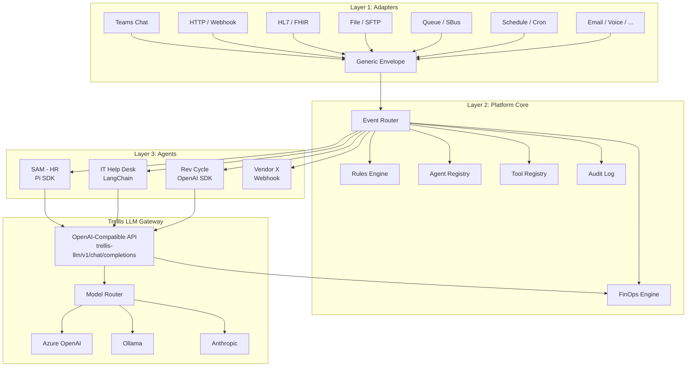
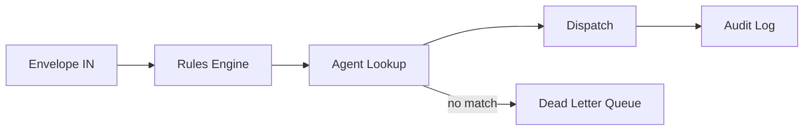
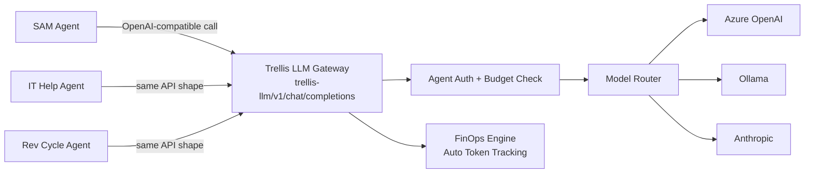
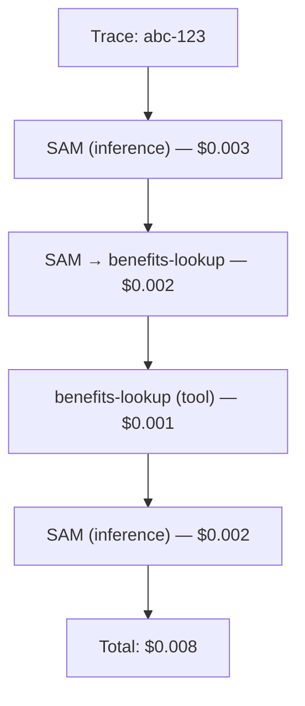
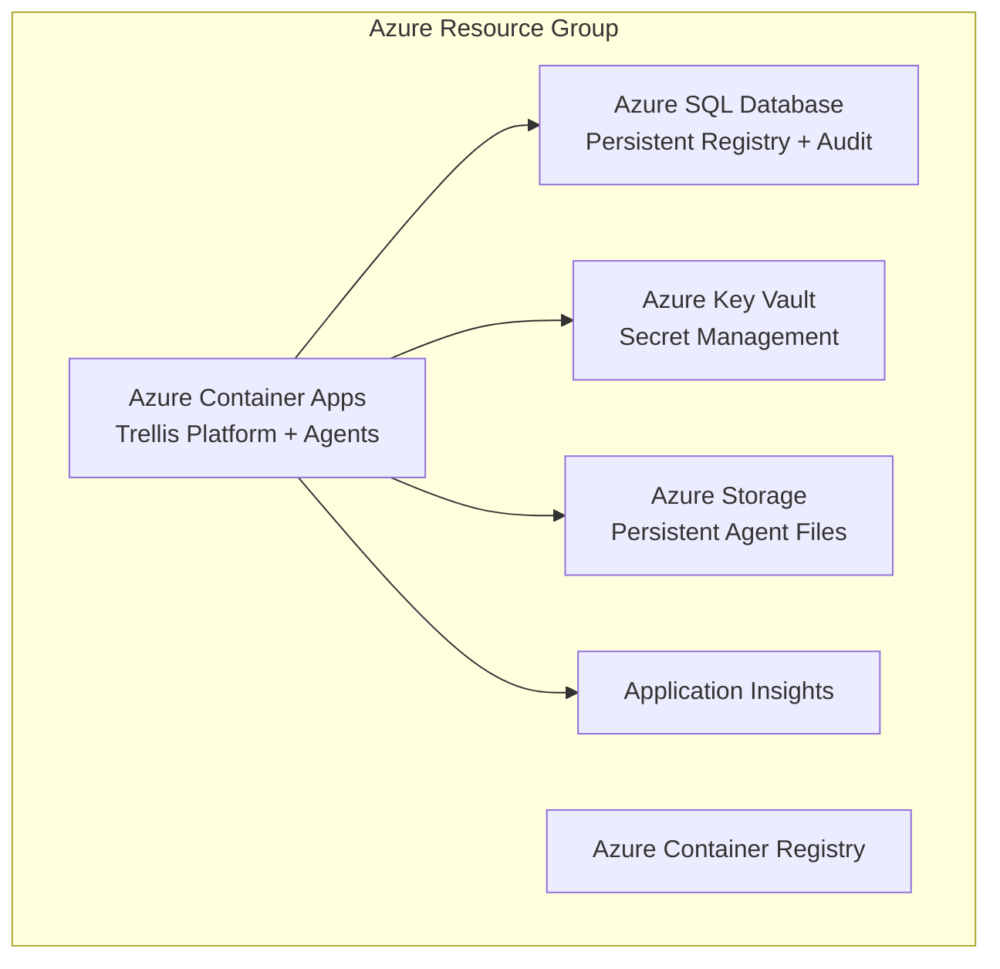

# Trellis — Enterprise AI Agent Orchestration

**Date:** 2026-02-22
**Status:** Architecture defined. Pre-implementation.
**Owner:** Eric O'Brien, SVP Enterprise Technology
**One-liner:** Kubernetes for AI agents — manage, route, and govern hundreds of agents across a healthcare system, regardless of framework.

---

## Executive Summary (BLUF)

Health First needs a platform that manages AI agents the way Kubernetes manages containers: deploy them, route work to them, track their costs, and audit every action — without caring what framework they run on. Today we have one agent (SAM, HR) built on Pi SDK. Tomorrow we'll have dozens across HR, Revenue Cycle, IT, Clinical, and Supply Chain. This architecture defines a three-layer system — adapters that normalize any input into a generic envelope, a platform core that routes and governs, and agents that do the actual work. The platform is Azure-native, HIPAA-ready, and designed so that a Pi SDK agent, an OpenAI Assistants agent, and a vendor black-box can all coexist under the same governance model. We chose a hybrid approach (Shape C) that gives managed agents free FinOps and model routing while letting external agents bring their own inference. The result: one dashboard, one audit trail, one cost model for every AI agent in the enterprise.

---

## Three-Layer Architecture



### Layer 1: Adapters (Edges)

Dumb translators. Each adapter knows one protocol and converts it into a generic envelope. No business logic, no routing decisions, no state. An adapter's entire job: receive input → build envelope → POST to event router.

Adapters are infrastructure. The platform team owns all of them.

Supported input types:
- **Teams chat** — human messages via Bot Framework webhook
- **HTTP/webhook** — system-to-agent calls, manual triggers
- **HL7/FHIR** — Epic events via Azure Health Data Services
- **File/SFTP** — blob drops, flat file triggers
- **Message queue** — Azure Service Bus, Kafka consumers
- **Database/CDC** — change data capture, new row triggers
- **Schedule/cron** — time-based triggers via Azure Functions timer
- **Log stream** — Sentinel, LogicMonitor alerts
- **Form submission** — ServiceNow/Ivanti ticket creation
- **Voice** — 8x8 call transcription → text
- **Email** — mailbox monitoring via Graph API
- **Document** — PDF, DOCX, TXT, CSV, Markdown uploads → chunked text envelopes
- **Agent-to-agent** — internal delegation (just another envelope)

### Layer 2: Platform Core

The brain. Receives envelopes, decides where they go, enforces governance, tracks costs, logs everything. Detailed in [Platform Core Components](#platform-core-components).

### Layer 3: Agents (Workers)

Do the actual work. Framework-agnostic. Agents keep full autonomy — they own the logic loop, tool chaining, memory, and decision-making. They run on any framework (Pi SDK, LangChain, OpenAI Assistants, raw Python).

The key architectural constraint: **agents use Trellis as their LLM provider.** Instead of calling `api.openai.com` directly, agents point at the Trellis LLM Gateway (`trellis-llm.hf.internal/v1/chat/completions`). Same OpenAI-compatible API shape — agents don't even know they're going through Trellis. They just use a different base URL.

This gives the platform full cost visibility, model routing, and rate limiting without stripping agents of their autonomy. Agents still decide what to ask, when to chain tools, how to reason. Trellis decides which model answers, tracks every token, and enforces budgets.

External/vendor agents that can't point at the gateway are the exception — they self-report costs with anomaly monitoring and budget caps.

---

## Generic Envelope Spec

Every input, regardless of source, becomes this:

```json
{
  "envelope_id": "uuid",
  "source_type": "teams|api|file|queue|schedule|hl7|log|form|voice|agent|manual",
  "source_id": "identifier for the specific source instance",
  "payload": {
    "text": "optional — human message or parsed content",
    "data": {},
    "attachments": []
  },
  "metadata": {
    "trace_id": "uuid — links entire event chain",
    "timestamp": "ISO-8601",
    "priority": "low|normal|high|critical",
    "sender": {
      "id": "azure-ad-oid or system identifier",
      "name": "display name",
      "department": "HR|IT|RevCycle|...",
      "roles": ["manager", "clinician", "admin"]
    }
  },
  "routing_hints": {
    "agent_id": "optional — direct routing bypass",
    "department": "optional — route to department's default agent",
    "category": "optional — semantic category for rules engine",
    "tags": []
  }
}
```

**Field notes:**
- `trace_id` is the single most important field. When Agent A delegates to Agent B, both envelopes share a `trace_id`. This is how we get end-to-end cost traces and audit chains.
- `source_type` + `source_id` together identify exactly which adapter instance produced the envelope. Useful for debugging and rate limiting.
- `routing_hints` are suggestions, not commands. The rules engine can override them. `agent_id` bypasses the rules engine only if the caller has direct-route permission.
- `payload.data` is unstructured. An HL7 adapter puts parsed FHIR resources here. A Teams adapter puts conversation context. The agent knows what to expect based on `source_type`.

---

## Platform Core Components

### Event Router

Receives envelopes from adapters via HTTP POST. Applies the rules engine to determine the target agent(s). Dispatches the envelope to the selected agent's registered endpoint. Handles fan-out (one event → multiple agents) and dead-letter (no matching rule → quarantine queue).



The router is stateless. It doesn't queue — it dispatches synchronously or fires-and-forgets to the agent's endpoint. If we need guaranteed delivery, Azure Service Bus sits between the router and the agent.

### Rules Engine

Pre-dispatch governance. Rules are data, stored in the database, editable via dashboard. A rule is:

```json
{
  "rule_id": "uuid",
  "name": "Epic ADT events to bed management agent",
  "priority": 100,
  "conditions": {
    "source_type": "hl7",
    "payload.data.event_type": "ADT^A01",
    "metadata.priority": { "$in": ["high", "critical"] }
  },
  "actions": {
    "route_to": "agent-bed-mgmt",
    "set_priority": "critical",
    "require_approval": false
  },
  "active": true
}
```

Rules evaluate top-down by priority. First match wins (unless fan-out is configured). Conditions use a simple JSON query syntax — no code, no DSL to learn. Complex routing logic means you need more rules, not a smarter engine.

### Agent Registry

Every agent in the enterprise is registered here. Registration is the gate — no registration, no traffic.

```json
{
  "agent_id": "sam-hr",
  "name": "SAM — HR Operations Agent",
  "owner": "Jane Smith",
  "department": "HR",
  "framework": "pi-sdk",
  "endpoint": "https://sam-hr.azurecontainerapps.io/envelope",
  "health_endpoint": "https://sam-hr.azurecontainerapps.io/health",
  "tools": ["peoplesoft-lookup", "ukg-schedule", "email-send"],
  "channels": ["teams", "api"],
  "maturity": "assisted",
  "cost_mode": "managed",
  "created": "2026-02-22T00:00:00Z",
  "last_health_check": "2026-02-22T21:00:00Z",
  "status": "healthy"
}
```

**Maturity levels:** `shadow` → `assisted` → `autonomous`. Shadow agents execute but a human reviews before the result is delivered. Assisted agents deliver results but flag uncertainty for human review. Autonomous agents operate independently. The platform enforces these — not the agent.

### Tool Registry

Tools exist independently of agents. A tool is a capability: "look up an employee in PeopleSoft," "send an email," "query Epic FHIR endpoint." Tools have schemas (input/output), endpoints, and permission policies.

```json
{
  "tool_id": "peoplesoft-lookup",
  "name": "PeopleSoft Employee Lookup",
  "description": "Query HCM for employee records by ID or name",
  "schema": { "input": { "employee_id": "string" }, "output": { "record": "object" } },
  "endpoint": "https://tools.hf.internal/peoplesoft/lookup",
  "phi": true,
  "allowed_agents": ["sam-hr", "hr-onboarding"],
  "rate_limit": "100/hour"
}
```

Agents don't discover tools — they're assigned tools via policy. The CISO office reviews any tool marked `phi: true` before it goes live.

### LLM Gateway

**The critical infrastructure component.** The gateway is an OpenAI-compatible API endpoint (`/v1/chat/completions`) that agents use instead of calling LLM providers directly. Agents point their SDK's `base_url` at the gateway — no code changes needed, any framework that speaks OpenAI API works.

**Why this matters:** This is how Trellis gets full visibility without stripping agents of autonomy. The agent still owns its logic — what to ask, when to chain tools, how to reason. The gateway controls *which model answers* and *tracks every token*.

The gateway provides:

- **Model routing** — route to the cheapest model that can handle the task complexity (see FinOps). Agent can request a model, or let Trellis pick.
- **Cost tracking** — every token counted, attributed to agent + trace. Automatic. No self-reporting needed.
- **Rate limiting** — per-agent, per-department quotas and budget caps.
- **Hot-swap** — change the backing model for any agent without touching the agent. SAM runs on GPT-4o today, Ollama tomorrow — one config change.
- **Fallback chains** — primary model fails → try secondary → try local Ollama.
- **Agent authentication** — agents call the gateway with a Trellis-issued API key. Gateway knows which agent is calling, applies that agent's model policy and budget.
- **Tool call passthrough** — the gateway proxies tool/function calls transparently. LLM returns a tool call → gateway passes it back to the agent. Agent executes the tool using its own identity. Gateway logs the full conversation (prompt → tool call → tool result → response) for audit without intercepting execution.



External/vendor agents that cannot point at the gateway self-report costs. They get budget caps and anomaly monitoring but not the full visibility of managed agents. This is the exception path, not the default.

### FinOps Engine

Every inference call, every tool invocation, every agent execution has a cost. The FinOps engine tracks it all.

Cost dimensions:
- **Per agent** — "SAM cost $47 this month"
- **Per query** — "This HR lookup cost $0.003"
- **Per department** — "HR agents cost $200/month total"
- **Per trace** — "This one Epic event triggered 3 agents and cost $0.15 end-to-end"

Data model:

```json
{
  "cost_event_id": "uuid",
  "trace_id": "links to envelope trace",
  "agent_id": "sam-hr",
  "department": "HR",
  "event_type": "llm_inference|tool_call|agent_execution",
  "model": "gpt-4o-mini",
  "tokens_in": 1200,
  "tokens_out": 350,
  "cost_usd": 0.002,
  "timestamp": "ISO-8601"
}
```

### Audit

Every action logged. Non-negotiable in healthcare. The audit log captures:

- Every envelope received (who sent what, when)
- Every routing decision (which rule matched, why)
- Every tool call (which agent called which tool, with what input)
- Every LLM inference (model, tokens, prompt — with PHI redaction)
- Every cost event
- Every agent registration change
- Every rule change

Audit logs are append-only, immutable, retained per HIPAA requirements (minimum 6 years). Stored in Azure Table Storage or Cosmos DB for cost efficiency at scale. Queryable via the dashboard.

---

## Agent Contract

To register on the platform, an agent must implement four endpoints:

### 1. `POST /envelope` — Handle Work

Accepts a generic envelope. Returns a result.

```json
// Request: Generic Envelope (see spec above)

// Response:
{
  "status": "completed|failed|delegated|pending_review",
  "result": {
    "text": "Human-readable response",
    "data": {},
    "attachments": []
  },
  "delegations": [
    { "target_agent": "agent-id", "envelope": { "..." } }
  ],
  "cost_report": {
    "inference_calls": 3,
    "total_tokens": 4500,
    "estimated_cost_usd": 0.008,
    "model": "gpt-4o-mini"
  }
}
```

### 2. `GET /health` — Health Check

Returns `200 OK` with `{ "status": "healthy|degraded|unhealthy" }`. Platform polls this every 60 seconds.

### 3. `POST /cost-report` — Cost Reporting (external agents only)

External agents that cannot use the Trellis LLM Gateway must POST cost data here on each execution. Managed agents skip this — the gateway tracks costs automatically because all inference flows through it.

### 4. `GET /manifest` — Agent Metadata

Returns the agent's registration data: name, tools needed, channels supported, maturity level. Used during initial registration and periodic sync.

That's it. Four endpoints. If you can serve HTTP, you can be an agent on this platform.

---

## Adapter Pattern

An adapter is a small, stateless service that converts a protocol-specific input into a generic envelope and POSTs it to the event router.

### Adapter Template

```typescript
interface Adapter {
  // Parse protocol-specific input into an envelope
  parse(raw: unknown): Envelope;

  // POST envelope to event router
  async forward(envelope: Envelope): Promise<void>;
}
```

Every adapter follows the same pattern:
1. Receive input in native protocol
2. Extract sender, content, metadata
3. Build envelope with appropriate `source_type`
4. Generate `envelope_id`, inherit or create `trace_id`
5. POST to `https://platform.hf.internal/router/envelope`

### Example: Teams Adapter

```typescript
// Receives Bot Framework Activity via webhook
app.post('/api/teams/messages', async (req, res) => {
  const activity: Activity = req.body;

  const envelope: Envelope = {
    envelope_id: crypto.randomUUID(),
    source_type: 'teams',
    source_id: `teams-${activity.channelId}-${activity.conversation.id}`,
    payload: {
      text: activity.text,
      data: {
        conversation_id: activity.conversation.id,
        message_id: activity.id,
        channel: activity.channelId
      },
      attachments: activity.attachments?.map(a => ({
        name: a.name,
        content_type: a.contentType,
        url: a.contentUrl
      })) ?? []
    },
    metadata: {
      trace_id: crypto.randomUUID(),
      timestamp: new Date().toISOString(),
      priority: 'normal',
      sender: {
        id: activity.from.aadObjectId,
        name: activity.from.name,
        department: '', // resolved by platform via Azure AD lookup
        roles: []
      }
    },
    routing_hints: {
      tags: ['teams-chat']
    }
  };

  await forwardToRouter(envelope);
  res.status(202).send();
});
```

### Example: HL7/FHIR Adapter (The Killer Demo)

This is where the platform becomes undeniable. Epic fires an ADT event — patient admitted, transferred, discharged. Before a nurse finishes their documentation, the platform has already routed it to the right agent.

```typescript
// Receives FHIR Subscription notification from Azure Health Data Services
// Epic → Azure FHIR Server → FHIR Subscription → This adapter
app.post('/api/fhir/notify', async (req, res) => {
  const bundle: fhir.Bundle = req.body;

  for (const entry of bundle.entry) {
    const resource = entry.resource;

    const envelope: Envelope = {
      envelope_id: crypto.randomUUID(),
      source_type: 'hl7',
      source_id: `epic-fhir-${resource.resourceType}`,
      payload: {
        text: `${resource.resourceType} event: ${extractEventSummary(resource)}`,
        data: {
          resource_type: resource.resourceType,
          resource_id: resource.id,
          event_type: extractEventType(resource), // ADT^A01, ORM^O01, etc.
          fhir_resource: resource
        },
        attachments: []
      },
      metadata: {
        trace_id: crypto.randomUUID(),
        timestamp: resource.meta?.lastUpdated ?? new Date().toISOString(),
        priority: classifyPriority(resource), // ADT = high, lab result = normal
        sender: {
          id: 'epic-system',
          name: 'Epic EMR',
          department: extractDepartment(resource),
          roles: ['system']
        }
      },
      routing_hints: {
        category: resource.resourceType,
        tags: ['clinical', 'epic', resource.resourceType.toLowerCase()]
      }
    };

    await forwardToRouter(envelope);
  }

  res.status(200).send();
});
```

**The demo:** Epic fires an ADT^A01 (patient admission). FHIR subscription hits the adapter. Adapter builds an envelope. Rules engine matches "ADT events → bed management agent." Agent checks bed availability, flags conflicts, notifies charge nurse — all before the admitting clerk closes their Epic screen. Show that end-to-end in a demo and the CIO gets it immediately.

---

## FinOps Model

### Managed Agents (Through LLM Gateway)

Cost tracking is automatic and tamper-proof. Agents use the Trellis LLM Gateway as their LLM provider (`base_url = trellis-llm.hf.internal/v1`). Every inference call flows through the gateway, which logs:
- Model used (what the agent requested vs. what was actually served)
- Input/output tokens
- Cost at current pricing
- Agent ID (from Trellis-issued API key) and trace ID
- Latency

No self-reporting. No trust required. The infrastructure measures it, same as how AWS measures your compute — not your app.

The gateway also handles **smart model routing**:

```
Incoming request → Complexity classifier → Model selection
                                            ├── Simple (FAQ, lookup) → GPT-4o-mini ($0.15/1M input)
                                            ├── Medium (analysis)    → GPT-4o ($2.50/1M input)
                                            └── Complex (reasoning)  → o1 ($15/1M input)
```

Complexity classification is itself a cheap LLM call (or rule-based heuristic). The savings from routing 80% of traffic to mini models dwarfs the classification cost.

### External Agents (Self-Reported)

Vendor agents and agents using non-standard inference (local models, custom APIs) self-report costs via the `/cost-report` endpoint in the agent contract. The platform trusts-but-verifies — anomaly detection flags cost reports that deviate significantly from historical patterns.

### Trace-Level Aggregation

One event can trigger a chain: user asks SAM about benefits → SAM delegates to benefits-lookup agent → that agent calls PeopleSoft tool → returns to SAM → SAM responds. The `trace_id` links every cost event in this chain. The dashboard shows:



Department gets billed $0.008 for that interaction. No surprises.

---

## Security & Compliance

### Authentication & Authorization

- **Azure AD** for all human and service identity. Every adapter, every agent, every dashboard user authenticates via Azure AD.
- **Managed identities** for service-to-service calls within Azure. No shared secrets.

### Agent Digital Identity

Every agent gets its own identity — not shared, not inherited from the platform. This is the foundation of governance:

- **Trellis API key** — authenticates to the LLM Gateway. Identifies which agent is making inference calls. Scoped to that agent's model policy and budget.
- **Azure AD Managed Identity** — authenticates to backend systems (PeopleSoft, Epic, UKG, ServiceNow). Each agent has its own identity with its own permissions in SailPoint/Azure AD.
- **Tool permissions** — scoped by identity. SAM's identity has access to PeopleSoft HCM. The IT help desk agent's identity has access to Ivanti. Neither can access the other's systems.
- **Budget cap** — monthly/daily cost limit enforced at the gateway. Hit the cap, agent gets throttled.

Agents execute their own tools using their own credentials. Trellis doesn't intercept tool execution — it sees tool calls in the LLM conversation stream (through the gateway) and audits them. But the actual access control is enforced by the existing IAM infrastructure (Azure AD + SailPoint). Security isn't a Trellis feature — it's an identity feature. Trellis ensures every agent *has* an identity.

- **RBAC model (human users):**
  - `platform-admin` — full access to all platform components
  - `department-admin` — manage agents/rules/tools for their department
  - `agent-operator` — view dashboards, trigger manual actions
  - `auditor` — read-only access to audit logs

### PHI Handling

- Tools marked `phi: true` require CISO review before activation
- Audit logs redact PHI from LLM prompts (log the hash, not the content)
- Agents accessing PHI run in isolated container groups with no internet egress except whitelisted endpoints
- All data at rest encrypted (Azure default). All data in transit over TLS.
- BAA in place with Azure and any LLM provider handling PHI

### Container Isolation

Each agent runs in its own Azure Container App with:
- Dedicated managed identity (least-privilege)
- Network isolation via VNet integration
- No shared storage between agents
- Resource limits (CPU/memory) enforced by platform

### HIPAA Alignment

- Audit logs retained 6+ years
- Access controls enforced at every layer
- Breach notification capability via audit trail queries
- Risk assessment documented per agent registration

---

## Operating Model

### Ownership

The platform team (IT ops / enterprise architecture) owns:
- Event router, rules engine, audit, FinOps engine
- Agent registry, tool registry, LLM gateway
- ALL adapters — adapters are infrastructure, not application code
- Dashboard and operational tooling

Think Azure landing zones. Central team owns the runway. Departments land their planes on it.

Departments own their agents. HR owns SAM. Revenue Cycle owns their coding assistant. IT owns the help desk agent. But every agent registers through the platform. Registration means:
- Listed in registry with owner, department, maturity level
- Tools and permissions reviewed
- Cost tracking active from day one
- Audit logging — non-negotiable

The platform team doesn't need to understand what every agent does. They need to know it's authorized, auditable, and not burning money.

### Support Model — "I Want an Agent"

1. **Intake** — Department fills out a one-page form: problem statement, data sources needed, tools required, expected volume.
2. **Feasibility** — Platform team assesses: adapters exist? Tools exist? PHI? New integrations? One-hour conversation, not a six-week project.
3. **Build** — Department builds (if they have developers) or requests platform team help. Agent must conform to the contract (four endpoints).
4. **Registration & Review** — Platform team reviews tool permissions. CISO reviews if PHI involved. This is the gate.
5. **Shadow → Assisted → Autonomous** — Standard maturity progression. Platform monitors cost and error rates. Department monitors output quality.

### Growth Path

- **Phase 1 (Now):** IT ops runs everything. SAM, IT help desk, 2-3 others. Prove the architecture works.
- **Phase 2:** Department self-service. Agent templates, SDK, permission review gate. Departments deploy their own agents within guardrails.
- **Phase 3:** Multi-facility. Facility-scoped agents, facility-level cost tracking, facility-specific routing rules.
- **Phase 4:** The architecture is healthcare-agnostic. Adapter pattern, agent contract, governance model — none of it is HF-specific. Worth keeping in mind.

---

## Technology Stack

The platform is split: **Python for the brain, TypeScript for the face.** Agents speak whatever they want — that's the point.

### Platform Core (Python)

| Component | Technology | Rationale |
|-----------|-----------|-----------|
| **Language** | Python 3.12+ | Azure-native (Functions, SDKs are Python-first). ML/AI ecosystem for smart model routing, complexity classification, anomaly detection. Biggest talent pool for backend infrastructure. |
| **API Framework** | FastAPI | Typed, async, auto-generated OpenAPI docs. Gold standard for Python APIs. |
| **ORM** | SQLAlchemy 2.0 (async) | Mature, battle-tested, async support. |
| **Validation** | Pydantic v2 | Built into FastAPI. Envelope schema validation for free. |
| **Database** | SQLite (dev) → PostgreSQL (prod) | Start simple. Azure Database for PostgreSQL Flexible Server in prod. |
| **Migrations** | Alembic | Standard for SQLAlchemy. |
| **Queue** | Azure Service Bus | Guaranteed delivery for critical paths (HL7 events, agent-to-agent). |
| **Auth** | Azure AD (MSAL for Python) | Enterprise standard. Managed identities for service-to-service. |
| **Containers** | Docker → Azure Container Apps | Each agent and each adapter is a container. Platform core is 1-2 containers. |
| **CI/CD** | GitHub Actions | Standard. Build → test → deploy to ACA. |
| **Monitoring** | Application Insights (OpenTelemetry) | Azure-native. Trace correlation with `trace_id`. |

### Dashboard (TypeScript)

| Component | Technology |
|-----------|-----------|
| **Framework** | Next.js 14+ (App Router) |
| **Styling** | Tailwind CSS |
| **Components** | shadcn/ui |
| **State** | TanStack Query (server state) + Zustand (client state) |
| **Tables** | TanStack Table |
| **Charts** | Recharts |
| **Real-time** | WebSocket or SSE for live agent activity |
| **Auth** | Azure AD via MSAL |
| **Aesthetic** | Dark ops dashboard — think Datadog meets SpaceCoast CMD. Real-time event flows, glowing health indicators, trace visualizations, cost meters. |

### Why the Split

The platform is agent-agnostic — agents are HTTP endpoints that speak envelope. **The platform shares zero code with agents.** The "one language" argument only applied when we thought the platform and agents were coupled. They're not.

Python wins for the platform core because:
1. **Azure-native** — Azure SDKs, Functions, and Container Apps are Python-first.
2. **ML/AI ecosystem** — smart model routing, complexity classification, cost anomaly detection, semantic routing via embeddings — all Python territory.
3. **Hiring** — if this grows, Python backend engineers are everywhere. TypeScript backend is a smaller pool.
4. **FastAPI is purpose-built for this** — typed, async, auto-docs, Pydantic validation. The envelope schema becomes a Pydantic model and you get validation for free.

TypeScript wins for the dashboard because:
1. Next.js + shadcn/ui + Tailwind is the best UI stack available. Period.
2. The richest charting, table, and real-time libraries are JavaScript-native.
3. This is where the "wow factor" lives — the dashboard is what leadership sees.

---

## Vertical Slice Plan

Each slice ends with a demo. No invisible infrastructure sprints.

### Slice 1: Platform Core + HTTP Adapter ✅
**Build:** Event router, agent registry (CRUD), HTTP adapter, SQLite database, basic envelope handling.
**Demo:** POST an envelope to the HTTP adapter → router looks up agent → dispatches to a mock agent → returns result.
**Status:** Complete. Running at `projects/trellis/`.

### Slice 2: LLM Gateway
**Build:** OpenAI-compatible API proxy (`/v1/chat/completions`). Agent authentication via Trellis API keys. Model routing (agent requests a model or Trellis picks). Token counting and cost logging. Tool/function call passthrough (logged but not intercepted). Budget caps per agent.
**Demo:** Agent calls `trellis-llm/v1/chat/completions` → gateway authenticates agent, picks model, proxies to Ollama/OpenAI, logs tokens and cost, returns response. Show cost attribution per agent.
**Effort:** 1-2 weeks.

### Slice 3: Agent Onboarding Framework ✅
**Build:** Agent types (http, webhook, function, llm-config). Registration flow with contract validation (hit `/health`, fetch `/manifest`). Agent identity provisioning (Trellis API key generation). Health check polling.
**Demo:** Register 3 different agent types, all receive envelopes and use the LLM gateway with their own identity and budget.
**Status:** Complete. Four agent types, auto-key provisioning, health check background task, manifest sync, type-aware dispatcher.

### Slice 4: Rules Engine + Audit ✅
**Build:** Enhanced rules engine with JSON condition matching ($gt, $gte, $lt, $lte, $exists, $regex, $not, $contains, $in, equality). Fan-out routing (one event → multiple agents). Rule testing endpoint. Rule toggle endpoint. Granular audit_events table with trace-level chains. Audit emission on all agent/key/rule CRUD, envelope routing, LLM gateway calls, and budget cap hits.
**Demo:** Create rules with complex conditions, test them via `/api/rules/test`, toggle enable/disable, fan-out to multiple agents, query audit trail by trace_id.
**Status:** Complete. 31 new tests (57 total), all passing.

### Slice 5: FinOps ✅
**Build:** Per-agent/department/trace cost rollups. Budget enforcement with 80%/100% alerts. Smart model routing (rule-based complexity classification: simple/medium/complex). Cost anomaly detection (3x 7-day average). Time-series cost data. FinOps executive summary endpoint.
**Demo:** Show cost breakdown after 50 queries — per agent, per department, per trace. Show budget cap throttling with audit events. Show smart model routing classifying prompts.
**Status:** Complete. 24 new tests (81 total), all passing.

### Slice 6: Dashboard
**Build:** Next.js dark ops dashboard — live event flow, agent health indicators, cost meters, rule editor, audit viewer, agent registry management.
**Demo:** Full ops dashboard. Register an agent, create a routing rule, send a message, watch it flow through in real-time, see the cost. The leadership demo.
**Effort:** 2-3 weeks.

### Slice 7: Teams Adapter + HL7/FHIR Adapter
**Build:** Bot Framework integration (Teams chat → envelope). FHIR subscription listener (Epic events → envelope). Both feed through the same platform core.
**Demo:** Message SAM in Teams, get a response, see the trace. Simulate an ADT^A01 Epic event, watch an agent respond before a human sees the alert. The CIO demo.
**Effort:** 2-3 weeks.

**Total estimated timeline:** 10-16 weeks for all seven slices, building serially. Slices 1-3 are the minimum viable platform.

---

## Production Environment

For production deployments (specifically within the Health First Azure tenant), Trellis shifts from a lightweight local stack to a high-availability enterprise architecture. This environment is designed to meet security, scalability, and persistence requirements.

### Infrastructure Topology



### Components

- **Database (Azure SQL):** Replaces ephemeral SQLite. Stores the Agent Registry, Tool Registry, Rules, and Audit Logs. Configured with a 'Basic' tier for cost efficiency during early production, scaling to Elastic Pools as agent volume grows.
- **Secrets (Azure Key Vault):** Centralized storage for sensitive API keys (OpenAI, Anthropic, Google) and database connection strings. Managed Identities are used for zero-secret authentication between Container Apps and Key Vault.
- **Storage (Azure Blob/Files):** Provides persistent storage for agents that need to maintain state across restarts or handle large file attachments (e.g., Clinical SFTP drops).
- **Compute (Azure Container Apps):** Serverless container hosting that scales agents to zero when idle, minimizing costs while maintaining sub-second cold starts for production traffic.

### Deployment Quality & Governance

As per **AGENTS.md (Information Quality section)**, all production configuration must be verified before assertion. The infrastructure is defined as code (Bicep) and validated using the Azure CLI (`az bicep build`) prior to deployment.

For environment-specific context regarding Health First's Azure configuration and naming conventions, refer to **USER.md**.

---

## Microsoft Teams Integration Best Practices

Trellis integrates with Microsoft Teams via the **Bot Framework Adapter** (specifically the `botbuilder-core` Python SDK).

1. **Authentication:** The Teams Adapter in Layer 1 validates the `Authorization` header on incoming webhooks from the Bot Framework Service. In production, `app_id` and `app_password` are managed via **Azure Key Vault**.
2. **Schema Handling:** All Teams activities are deserialized into standard `Activity` objects before being mapped into the **Generic Envelope Spec**.
3. **Turn Context:** The adapter maintains a `TurnContext` for each interaction, ensuring that agent responses are correctly routed back to the specific conversation/tenant.
4. **FastAPI Integration:** The production adapter is implemented as a FastAPI endpoint (`/api/messages`), allowing it to coexist with the Trellis Platform Core on the same compute resource.

- **SAM agent** — working HR operations agent built on Pi SDK. Handles PTO policy questions, employee lookups, onboarding checklists via mock tools. Runs locally against Ollama (llama3.1:8b).
- **Mock HR tools** — PeopleSoft lookup, UKG schedule query, benefits lookup. Currently hardcoded responses, designed to be swapped for real integrations.
- **Pi SDK foundation** — conversation management, tool orchestration, context handling. Solid framework for a single agent.

### How It Evolves

SAM doesn't get thrown away. It becomes the first tenant on the platform:

1. **Wrap SAM** with the agent contract — add `/envelope`, `/health`, `/cost-report`, `/manifest` endpoints around the existing Pi SDK logic.
2. **Register SAM** in the platform's agent registry. Assign it the `peoplesoft-lookup`, `ukg-schedule`, and `email-send` tools.
3. **Route to SAM** via rules: `source_type=teams AND department=HR → sam-hr`.
4. **Move inference** through the LLM gateway. SAM's Pi SDK calls go through the gateway instead of directly to Ollama/Azure OpenAI. Instant FinOps visibility.
5. **Promote SAM** through maturity levels: shadow → assisted → autonomous as confidence grows.

The existing codebase becomes a reference implementation — proof that the agent contract works, that the adapter pattern is clean, that the platform adds governance without adding friction. Every subsequent agent follows SAM's path.

---

---

## Pluggable Agent Runtimes

**Date:** 2026-02-23
**Directive:** "Pi should be the default agent and one could be provisioned through Trellis. Keep agnostic option for other things. Make it simple to replace when the next Pi comes along."

### Design Principle

Trellis is the **control plane**. It doesn't run agent logic — it delegates to **runtimes**. A runtime is anything that can start an agent, send it work, check its health, and stop it. Four methods. That's the whole interface.

Pi is the default runtime today. Tomorrow it could be something else. The swap should take an afternoon, not a sprint.

### Runtime Interface

```python
class AgentRuntime(ABC):
    runtime_type: str                                           # "pi", "http", "function", etc.
    async def start(config: AgentConfig) -> AgentInstance       # Provision agent
    async def stop(instance_id: str) -> None                    # Tear down
    async def send(instance_id: str, payload: dict) -> Response # Send work
    async def health(instance_id: str) -> HealthStatus          # Health check
```

**AgentConfig** carries everything needed to spin up an agent: system prompt, model, tools, temperature, max_tokens, plus an `extras` dict for runtime-specific options (sandbox config, budget caps, Pi SDK options, etc.).

### Shipped Runtimes

| Runtime | Type | Description |
|---------|------|-------------|
| **PiRuntime** | `pi` | Default. Uses Pi SDK's Agent class. Phase 1: LLM gateway dispatch. Phase 2: full Pi agent loop with tools + streaming. |
| **HttpRuntime** | `http` | Backward compat. POSTs envelopes to external HTTP endpoints. For vendor agents, legacy agents, anything with a URL. |

### How It Works

```
Agent Registration (with runtime_type="pi")
    ↓
Event Router matches envelope to agent
    ↓
Dispatcher looks up agent's runtime_type
    ↓
RuntimeRegistry.get("pi") → PiRuntime
    ↓
PiRuntime.start(config) → instance
PiRuntime.send(instance_id, envelope) → response
PiRuntime.stop(instance_id)
    ↓
Response back through event router → audit
```

### Agent Registration

When registering an agent, `runtime_type` defaults to `"pi"`:

```json
{
  "agent_id": "sam-hr",
  "name": "SAM - HR Operations",
  "runtime_type": "pi",
  "llm_config": {
    "system_prompt": "You are SAM, an HR operations assistant...",
    "model": "qwen3:8b"
  }
}
```

For legacy HTTP agents:
```json
{
  "agent_id": "vendor-x",
  "runtime_type": "http",
  "endpoint": "https://vendor-x.example.com/envelope",
  "health_endpoint": "https://vendor-x.example.com/health"
}
```

### Writing a New Runtime

1. Create `trellis/runtimes/your_runtime.py`
2. Implement the 4 methods of `AgentRuntime`
3. Register it: `register_runtime(YourRuntime())`
4. Agents can now use `runtime_type="your_runtime"`

Example — a hypothetical LangChain runtime:

```python
class LangChainRuntime(AgentRuntime):
    runtime_type = "langchain"

    async def start(self, config):
        chain = build_chain(config.system_prompt, config.tools)
        # ... store instance
        return AgentInstance(...)

    async def send(self, instance_id, payload):
        result = await self._chains[instance_id].ainvoke(payload)
        return RuntimeResponse(status="success", data=result)

    # ... stop, health
```

### File Layout

```
trellis/runtimes/
├── __init__.py          # Public API
├── interface.py         # AgentRuntime ABC + dataclasses
├── registry.py          # RuntimeRegistry singleton
├── pi_runtime.py        # Default: Pi SDK agents
└── http_runtime.py      # Backward compat: HTTP agents
```

### Migration Path

Existing agents (`agent_type=http|function|llm`) continue to work via legacy dispatch. The `runtime_type` field defaults to `"pi"` for new agents. Existing agents can be migrated by setting their `runtime_type` — no breaking changes.

---

## Document Ingestion Adapter

**Date:** 2026-03-05
**Status:** Complete. 28 tests passing.

### Why It Matters

Hospitals run on documents — policies, procedures, clinical guidelines, compliance manuals, formularies. These live as PDFs on SharePoint, shared drives, email attachments. Agents need to process them as events: a new infection control policy drops → the compliance agent indexes it, the clinical agent can answer questions about it, the training agent flags staff who need re-certification.

### Architecture

The document adapter follows the standard adapter pattern: receive input → extract text → build envelopes → route through event system. The twist: documents are chunked into segments so agents can process them incrementally without hitting token limits.

```
Upload (PDF/DOCX/TXT/CSV/MD)
    ↓
Format Detection (extension or MIME type)
    ↓
Text Extraction (PyPDF2 for PDF, python-docx for DOCX, stdlib for rest)
    ↓
Chunking (configurable size + overlap)
    ↓
One Envelope per chunk → Event Router → Rules Engine → Agent(s)
```

### Files

| File | Purpose |
|------|---------|
| `trellis/adapters/document_adapter.py` | Adapter: `build_document_envelopes()`, `build_batch_envelopes()` |
| `trellis/adapters/document_utils.py` | Utilities: text extraction, chunking, format detection |
| `tests/test_document_adapter.py` | 28 tests covering extraction, chunking, envelopes, batch |

### Envelope Shape

Each chunk becomes an envelope with `source_type="document"`:

```json
{
  "source_type": "document",
  "source_id": "document-pdf",
  "payload": {
    "text": "chunk content...",
    "data": {
      "filename": "infection-control-policy.pdf",
      "format": "pdf",
      "page": 3,
      "chunk_index": 7,
      "total_chunks": 24,
      "content_type": "application/pdf",
      "document_type": "policy",
      "department": "Infection Control",
      "effective_date": "2026-03-01",
      "author": "Dr. Smith",
      "version": "2.1"
    }
  },
  "routing_hints": {
    "tags": ["document", "pdf", "policy", "infection control"],
    "category": "document-ingestion",
    "department": "Infection Control"
  }
}
```

### Healthcare Metadata

Optional metadata fields for healthcare document classification:

| Field | Purpose | Examples |
|-------|---------|----------|
| `document_type` | Classification | policy, procedure, guideline, protocol, compliance, form |
| `department` | Originating department | Infection Control, Pharmacy, Nursing, Compliance |
| `effective_date` | When document takes effect | ISO-8601 date |
| `author` | Document author | Dr. Smith, Compliance Committee |
| `version` | Document version | 2.1, Rev C |

### Chunking Configuration

- **Default chunk size:** 1000 characters
- **Default overlap:** 200 characters (ensures no context is lost at boundaries)
- Both configurable per upload

### Supported Formats

| Format | Library | Notes |
|--------|---------|-------|
| PDF | PyPDF2 | Graceful error if not installed |
| DOCX | python-docx | Graceful error if not installed |
| TXT | stdlib | Always available |
| CSV | stdlib | Converted to readable text |
| Markdown | stdlib | Passed through as-is |

### Routing Rules Example

```json
{
  "name": "New policies to compliance agent",
  "conditions": {
    "source_type": "document",
    "payload.data.document_type": "policy"
  },
  "actions": {
    "route_to": "compliance-agent"
  }
}
```

---

*This architecture was designed during a session with Eric O'Brien on 2026-02-22. Runtime interface added 2026-02-23 per Eric's directive to make Pi the default runtime while keeping the platform runtime-agnostic. Document ingestion adapter added 2026-03-05.*
