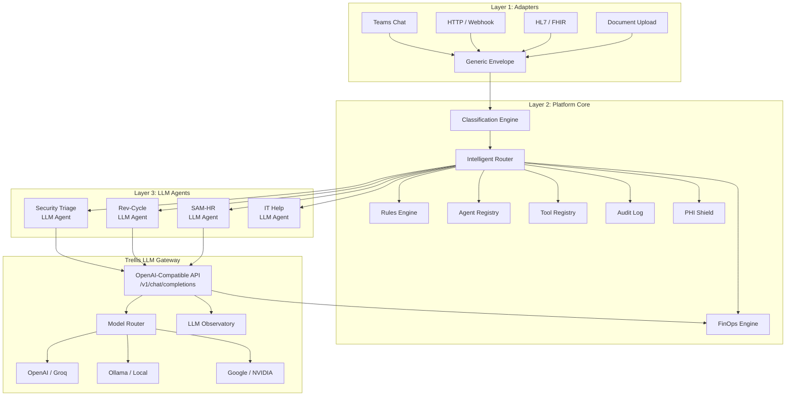

# Trellis — Enterprise AI Agent Orchestration Platform

> **"Kubernetes for AI agents."** Deploy, route, govern, and track costs for hundreds of AI agents across the enterprise — regardless of framework.

[](#tests)
[](#quick-start)
[](#)

---

## Why Trellis?

**For CIOs and enterprise architects** who need to answer: *"How many AI agents do we have, what are they doing, and what are they costing us?"*

| Challenge | Without Trellis | With Trellis |
|-----------|----------------|--------------|
| **Agent visibility** | Agents scattered across teams, no central registry | Every agent registered, health-checked, auditable |
| **Cost control** | Each agent calls LLMs directly — no budget caps, no tracking | Centralized LLM gateway with per-agent budgets, anomaly detection |
| **Governance** | No audit trail, no routing rules, manual oversight | Every event logged, rules-based routing, full trace chains |
| **PHI protection** | Developers must remember to redact PHI | Infrastructure-level PHI detection and redaction before LLM inference |
| **Framework lock-in** | Tied to one SDK/framework | Framework-agnostic — any agent that speaks HTTP works |
| **Scaling** | Adding agents = adding chaos | Adding agents = registering them in Trellis |

---

## Architecture



**Three layers, clean separation:**

1. **Adapters** — Dumb translators. Convert any input (Teams, HTTP, HL7, FHIR, documents) into a Generic Envelope. No logic, no state.
2. **Platform Core** — The brain. Classifies envelopes, routes them via intelligent scoring or rules, registers agents and tools, shields PHI, tracks costs, logs everything.
3. **LLM Agents** — Do the actual work. Each agent is defined by a system prompt + tool permissions + model config. They call the Trellis LLM Gateway — same OpenAI-compatible API, full cost visibility.

---

## Quick Start

### Prerequisites

- **Python 3.11+** with [uv](https://docs.astral.sh/uv/) package manager
- **An LLM provider** — at least one of:
  - **NVIDIA NIM** (recommended) — free tier at [build.nvidia.com](https://build.nvidia.com). The seed agents are pre-configured for NVIDIA.
  - **Groq** — fast inference, free tier at [console.groq.com](https://console.groq.com)
  - **OpenAI** / **Google** — standard API keys
  - **Ollama** — local only, not available in cloud deploys

### 1. Clone, install, and configure

```bash
git clone https://github.com/kraftwerkur/trellis.git
cd trellis
cp .env.example .env          # ← Edit this! Add your NVIDIA_API_KEY (or other provider)
uv sync                       # Install dependencies
uv run -m trellis.main        # Start server on port 8000
```

> **Important:** Open `.env` and set `NVIDIA_API_KEY=nvapi-...` (or configure another provider). The seed agents use NVIDIA NIM models. Without a configured provider, agents can't do LLM inference.

**Swagger UI:** [http://localhost:8000/docs](http://localhost:8000/docs)

### 2. Seed the platform (optional — gives you 9 agents + routing rules instantly)

```bash
# In a second terminal:
bash deploy/seed.sh
```

This registers all built-in agents, creates routing rules, and sends test envelopes so you can explore immediately.

### 3. Register an LLM agent manually

```bash
curl -s -X POST http://localhost:8000/api/agents \
  -H "Content-Type: application/json" \
  -d '{
    "agent_id": "security-triage",
    "name": "Security Triage Agent",
    "owner": "Security Team",
    "department": "Information Security",
    "framework": "trellis-native",
    "agent_type": "llm",
    "system_prompt": "You are a security triage analyst. Analyze vulnerabilities, cross-reference CISA KEV, and provide risk assessments with remediation priorities.",
    "tools": ["check_cisa_kev", "lookup_tech_stack", "get_cvss_details", "calculate_risk_score"],
    "channels": ["api"],
    "maturity": "assisted",
    "llm_config": {"model": "meta/llama-3.3-70b-instruct", "provider": "nvidia", "temperature": 0.1, "max_tokens": 2048}
  }' | python3 -m json.tool
```

**What just happened:** You registered an LLM agent. Trellis now knows its system prompt, which tools it can call, and which model to use. No code was written — the agent is defined entirely by configuration.

### 4. Create a routing rule and send work

```bash
# Create a rule: route security envelopes to our agent
curl -s -X POST http://localhost:8000/api/rules \
  -H "Content-Type: application/json" \
  -d '{
    "name": "Security events to triage",
    "priority": 100,
    "conditions": {"department": "Information Security"},
    "actions": {"route_to": "security-triage"}
  }' | python3 -m json.tool

# Send an envelope — the agent will process it using its LLM + tools
curl -s -X POST http://localhost:8000/api/envelopes \
  -H "Content-Type: application/json" \
  -d '{
    "source_type": "api",
    "department": "Information Security",
    "body": {"text": "CVE-2024-3400 found on our Palo Alto firewall. Is this in CISA KEV? What is the CVSS score and recommended priority?"}
  }' | python3 -m json.tool
```

### 5. Explore the platform

```bash
# View all registered agents
curl -s http://localhost:8000/api/agents | python3 -m json.tool

# Check the audit trail
curl -s http://localhost:8000/api/audit | python3 -m json.tool

# View cost summary
curl -s http://localhost:8000/api/finops/summary | python3 -m json.tool

# Test PHI detection
curl -s -X POST http://localhost:8000/api/phi/detect \
  -H "Content-Type: application/json" \
  -d '{"text": "Patient SSN 123-45-6789, MRN-78432"}' | python3 -m json.tool
```

---

## Configure LLM Providers

Trellis ships with **Ollama as the default** — if Ollama is running locally, agents work out of the box with no API keys.

To enable cloud providers, add keys to your `.env` file:

```bash
# .env — configure at least one provider
NVIDIA_API_KEY=nvapi-...                        # Recommended (seed agents use this)
# TRELLIS_OPENAI_API_KEY=sk-...                 # Optional
# TRELLIS_GROQ_API_KEY=gsk_...                  # Optional (fast, free tier)
# TRELLIS_GOOGLE_API_KEY=AIza...                # Optional
# TRELLIS_OLLAMA_URL=http://localhost:11434/v1   # Local dev only
```

The seed agents are pre-configured for **NVIDIA NIM** (`meta/llama-3.3-70b-instruct`). Get a free API key at [build.nvidia.com](https://build.nvidia.com). To use a different provider, update the `provider` field in the agent's `llm_config` when registering.

The LLM Gateway exposes an **OpenAI-compatible** `/v1/chat/completions` endpoint. Any framework or tool that speaks the OpenAI API can use it.

See `.env.example` for all configurable environment variables.

---

## Available Tools

Trellis includes **13 built-in tools** that LLM agents can use. Assign tools to agents via the `tools` array during registration.

| Tool | Domain | Description |
|------|--------|-------------|
| `check_cisa_kev` | Security | Check if a CVE is in the CISA Known Exploited Vulnerabilities catalog |
| `lookup_tech_stack` | Security | Look up technology stack for a given system |
| `get_cvss_details` | Security | Retrieve CVSS score and vector for a CVE |
| `calculate_risk_score` | Security | Calculate composite risk score from multiple factors |
| `classify_ticket` | IT | Classify an IT support ticket by category and type |
| `assess_priority` | IT | Assess ticket priority based on impact and urgency |
| `lookup_known_resolution` | IT | Search knowledge base for known resolutions |
| `classify_hr_case` | HR | Classify an HR case by type and sensitivity |
| `assess_hr_priority` | HR | Assess HR case priority and escalation needs |
| `lookup_hr_policy` | HR | Look up relevant HR policies for a case |
| `classify_rev_cycle_case` | Revenue Cycle | Classify a revenue cycle case (denial, underpayment, etc.) |
| `analyze_denial` | Revenue Cycle | Analyze claim denial reasons and suggest appeals |
| `assess_rev_cycle_priority` | Revenue Cycle | Assess financial priority of revenue cycle cases |

Tools are permission-controlled — agents can only call tools explicitly assigned to them. Custom tools can be registered via the Tool Registry API with JSON schema definitions.

---

## Docker

```bash
docker compose up -d --build
```

- **API:** [http://localhost:8100](http://localhost:8100) (mapped from container port 8000; Swagger at `/docs`)
- **Dashboard:** [http://localhost:3000](http://localhost:3000)

```bash
docker compose down          # Stop containers
docker compose down -v       # Stop and delete data volume
```

---

## Dashboard

Start the Next.js dashboard alongside the API:

```bash
cd dashboard && npm install && npm run dev
```

Open [http://localhost:3000](http://localhost:3000) — a dark ops command center with **11 pages:** Overview, Agents, Rules, FinOps, PHI Shield, Audit, Gateway, Observatory, Health, Routing, and Tools.

---

## Platform Capabilities

### Core Platform
- **Event Router** — receives Generic Envelopes from adapters, dispatches to agents via rules or intelligent scoring
- **Agent Registry** — CRUD for all agents with health checking, manifest sync, and maturity levels (shadow -> assisted -> autonomous)
- **Rules Engine** — JSON condition matching with operators (`$gt`, `$lt`, `$regex`, `$contains`, `$in`, `$exists`, `$not`), fan-out routing, rule toggle, dry-run testing
- **Audit Log** — immutable, append-only event trail covering every envelope, routing decision, dispatch, and response with full trace chain visibility
- **Classification Engine** — auto-classifies inbound envelopes by department, category, severity, and entities before routing

### LLM Gateway
- OpenAI-compatible `/v1/chat/completions` endpoint — any framework that speaks OpenAI API works
- **Multi-provider support:** Ollama (local), OpenAI, Groq, Google, NVIDIA
- **Manifest-based model scoring** — complexity classifier routes simple queries to cheap models, complex reasoning to capable models
- API key authentication (SHA-256 hashed, `trl_` prefixed)
- Per-request cost tracking with token counting
- Per-agent daily/monthly budget caps (429 on exceeded)
- Provider allowlists and per-agent LLM configuration

### PHI Shield
- HIPAA-compliant PHI/PII detection and redaction engine
- Covers all **18 HIPAA Safe Harbor identifiers** plus healthcare-specific types (MRN, NPI, ICD-10, CPT, Health Plan ID, Device ID)
- **Dual detection:** regex patterns (structured data) + Presidio NLP (unstructured names, addresses)
- **Per-agent shield modes:** `full` (redact -> LLM -> rehydrate), `redact_only`, `audit_only`, `off`
- **Ephemeral token vault** — PHI never persisted, never logged
- False-positive suppression for drug names and facility names
- Integrated into LLM Gateway: automatic redaction before model inference

### FinOps Engine
- **Cost attribution** by agent, department, and trace chain
- Time-series cost data (hour/day/week granularity)
- Department drill-down with per-agent breakdowns
- **Budget tracking** with alerts at 80% threshold and hard caps at 100%
- Cost anomaly detection (statistical deviation from rolling average)
- Complexity classifier for smart model routing (simple/medium/complex)
- Executive FinOps summary endpoint

### Intelligent Routing
- **6-dimension scoring:** category affinity (25%), semantic similarity (25%), source type (20%), keyword overlap (15%), system match (10%), priority alignment (5%)
- **Semantic similarity** — uses sentence embeddings to match envelope content against agent descriptions (auto-downloads model on first use)
- **Agent intake declarations** — agents declare what they handle; no manual rule creation needed
- **Hierarchical categories** with dot-notation (e.g., `security.vulnerability.cvss_critical`)
- **Shadow mode** — run scored routing alongside rules, compare results before switching
- **Feedback loop** — per-agent, per-category success rate updates via EMA
- **Load-aware routing** — in-flight tracking penalizes overloaded agents
- Overlap detection warns when agent intake declarations conflict
- Adaptive dimension weights that shift based on historical accuracy

### LLM Observatory
- Per-model performance metrics: latency, token efficiency, error rates
- Hourly breakdown and trend analysis
- Multi-agent model usage aggregation
- Cost-per-request tracking across providers
- Model comparison dashboard

### Health Auditor
- **7 infrastructure checks:** agent health, database connectivity, background tasks, SMTP, system resources (disk/memory), adapter status (HTTP/Teams/FHIR)
- Cached quick-check endpoint for real-time dashboard status
- Health history persistence with filtering and limit controls

### Tool Registry
- Framework-agnostic tool definitions with JSON schemas
- Permission-based access control (per-agent tool allowlists, wildcard support)
- Execution logging with call counts and error tracking
- **13 built-in domain tools** across Security, IT, HR, and Revenue Cycle
- Decorator-style registration for custom tools

### Adapters
- **HL7v2** — native pipe-delimited parser for ADT^A01, ADT^A03, ORM^O01, ORU^R01, SIU^S12
- **FHIR R4** — Patient, Encounter, Observation, Appointment, DiagnosticReport, ServiceRequest resources; subscription webhook support
- **Teams** — Bot Framework integration with JWT validation, Adaptive Cards
- **Document** — PDF, DOCX, TXT, CSV, Markdown ingestion with configurable chunking and healthcare metadata
- **HTTP** — simplified input -> envelope for generic integrations

### Native Agents
| Agent | Purpose |
|-------|---------|
| **SAM-HR** | HR operations — PTO policy, employee lookups, onboarding checklists |
| **Rev-Cycle** | Revenue cycle — claims processing, denial management, payer analysis |
| **Security Triage** | Vulnerability cross-referencing, risk scoring, advisory drafting |
| **IT Help** | IT service desk — ticket routing and resolution |
| **Rule Optimizer** | Platform housekeeping — dead rule detection, overlap analysis, routing suggestions |
| **Health Auditor** | Infrastructure health — 7-check auditor with trend analysis |
| **Audit Compactor** | Data lifecycle — audit log compaction and archival |
| **Cost Optimizer** | FinOps — model downgrade recommendations, cost-per-resolution trends |
| **Schema Drift Detector** | Data quality — payload structure change detection |

---

## Tests

```bash
uv sync
uv run pytest tests/ -v
```

**623 tests** covering: platform core, LLM gateway, agent onboarding, rules engine, audit trail, FinOps engine, PHI shield, HL7/FHIR adapters, Teams adapter, document adapter, LLM observatory, health auditor, intelligent router, semantic routing, tool registry, audit compactor, agent loop, and classification engine.

---

## Key API Endpoints

| Method | Endpoint | Description |
|--------|----------|-------------|
| POST | `/api/agents` | Register an agent |
| GET | `/api/agents` | List all agents |
| POST | `/api/envelopes` | Submit an envelope for routing |
| POST | `/api/rules` | Create a routing rule |
| GET | `/api/audit` | View audit log |
| GET | `/api/finops/summary` | Cost summary |
| POST | `/api/phi/detect` | Test PHI detection |
| POST | `/v1/chat/completions` | LLM Gateway (OpenAI-compatible) |
| GET | `/docs` | Swagger UI |

See **[API.md](API.md)** for the complete API documentation with request/response examples.

---

## Project Structure

```
trellis/
├── main.py                     # FastAPI app + lifespan
├── config.py                   # Settings (pydantic-settings)
├── database.py                 # Async SQLAlchemy engine
├── models.py                   # SQLAlchemy ORM models
├── schemas.py                  # Pydantic request/response schemas
├── api.py                      # REST API routers
├── router.py                   # Event router + dispatching
├── gateway.py                  # LLM Gateway (/v1/chat/completions)
├── agent_loop.py               # LLM agent execution loop (prompt + tools)
├── agent_context.py            # Agent runtime context and state
├── classification.py           # Envelope classification engine
├── intelligent_router.py       # 6-dimension scored routing
├── embeddings.py               # Sentence embeddings for semantic routing
├── delegation.py               # Agent-to-agent delegation
├── phi_shield.py               # PHI detection, redaction, rehydration
├── observatory.py              # LLM model performance tracking
├── tool_registry.py            # Tool definitions + permission enforcement
├── functions.py                # Built-in function implementations
├── adapters/
│   ├── http_adapter.py         # Generic HTTP -> envelope
│   ├── hl7_adapter.py          # HL7v2 parser (ADT, ORM, ORU, SIU)
│   ├── fhir_adapter.py         # FHIR R4 resources + subscriptions
│   ├── teams_adapter.py        # Bot Framework + JWT validation
│   ├── teams_cards.py          # Adaptive Card builders
│   ├── document_adapter.py     # Document ingestion + chunking
│   └── document_utils.py       # Text extraction utilities
├── agents/
│   ├── sam_hr.py               # SAM — HR operations agent
│   ├── rev_cycle.py            # Revenue cycle agent
│   ├── security_triage.py      # Security triage agent
│   ├── it_help.py              # IT help desk agent
│   ├── rule_optimizer.py       # Platform housekeeping: rule analysis
│   ├── health_auditor.py       # Platform housekeeping: infra health
│   ├── audit_compactor.py      # Platform housekeeping: log compaction
│   ├── cost_optimizer.py       # Platform housekeeping: cost analysis
│   ├── schema_drift.py         # Platform housekeeping: schema monitoring
│   └── tools.py                # Shared agent tool definitions
├── outputs/
│   └── email.py                # Email output hook
├── dashboard/                  # Next.js dashboard (11 pages)
├── deploy/                     # Azure deployment (Bicep + scripts)
├── alembic/                    # Database migrations
└── tests/                      # 623 tests
```

For deep architectural details, see **[ARCHITECTURE.md](ARCHITECTURE.md)**.

---

## Competitive Landscape

| | **Trellis** | **Airia** | **AWS Bedrock AgentCore** | **ServiceNow AI Agents** |
|--|-------------|-----------|--------------------------|--------------------------|
| **Model** | Self-hosted, open | SaaS | Cloud (AWS) | SaaS (ServiceNow) |
| **Framework lock-in** | None | Their platform | AWS ecosystem | ServiceNow ecosystem |
| **LLM Gateway** | OpenAI-compatible, multi-provider | Multi-model | AWS models | Built-in only |
| **PHI Shield** | 18 HIPAA identifiers + healthcare types | No | Partial | No |
| **FinOps** | Per-agent budgets, anomaly detection | Yes | Partial (CloudWatch) | No |
| **Intelligent Routing** | 6-dimension scoring + semantic + feedback loop | No | No | No |
| **Healthcare Adapters** | HL7v2, FHIR R4, Teams | No | No | Partial |
| **Data residency** | Your infrastructure | Their cloud | AWS regions | ServiceNow DCs |
| **Cost** | Free (build it) | Enterprise licensing | Pay-per-use | Per-seat |

### Why self-hosted matters for healthcare

Regulated industries face a fundamental tension: **AI agents need access to sensitive data, but that data can't leave your perimeter.** Trellis runs entirely inside your network. The LLM Gateway can point to Azure OpenAI (with your own BAA) or local models via Ollama. Agent traffic never leaves your infrastructure. Audit logs stay in your databases.

---

## Roadmap

- [x] LLM-first agent model (system prompt + tools, no code)
- [x] 6-dimension intelligent routing with semantic similarity
- [x] 13 built-in domain tools
- [x] Agent-to-agent delegation
- [ ] Streaming support for LLM Gateway
- [ ] Role-based access control (RBAC)
- [ ] Azure SQL migration (production persistence)
- [ ] Production HIPAA hardening (PHI default modes, CORS lockdown, management plane auth)

---

## Azure Deployment

One-command deploy via `deploy/deploy.sh` to Azure Container Apps. Bicep infrastructure-as-code (Container Registry, Key Vault, Log Analytics). Scales to zero when idle (~$5-10/mo at demo scale). Runs entirely within your Azure tenant — PHI never leaves your perimeter.

See **[deploy/README.md](deploy/README.md)** for details.
