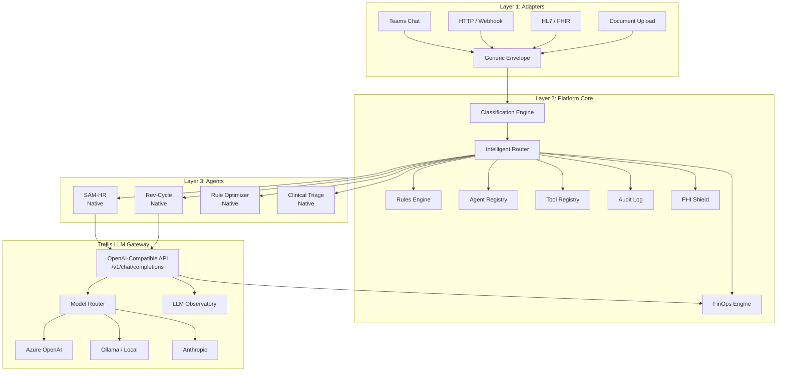

# Trellis — Enterprise AI Agent Orchestration Platform

> **"Kubernetes for AI agents."** Deploy, route, govern, and track costs for hundreds of AI agents across the enterprise — regardless of framework.

[](#tests)
[](#quick-start)
[](#)

---

## Why Trellis?

**For CIOs and enterprise architects** who need to answer: *"How many AI agents do we have, what are they doing, and what are they costing us?"*

| Challenge | Without Trellis | With Trellis |
|-----------|----------------|--------------|
| **Agent visibility** | Agents scattered across teams, no central registry | Every agent registered, health-checked, auditable |
| **Cost control** | Each agent calls LLMs directly — no budget caps, no tracking | Centralized LLM gateway with per-agent budgets, anomaly detection |
| **Governance** | No audit trail, no routing rules, manual oversight | Every event logged, rules-based routing, full trace chains |
| **PHI protection** | Developers must remember to redact PHI | Infrastructure-level PHI detection and redaction before LLM inference |
| **Framework lock-in** | Tied to one SDK/framework | Framework-agnostic — any agent that speaks HTTP works |
| **Scaling** | Adding agents = adding chaos | Adding agents = registering them in Trellis |

---

## Architecture



**Three layers, clean separation:**

1. **Adapters** — Dumb translators. Convert any input (Teams, HTTP, HL7, FHIR, documents) into a Generic Envelope. No logic, no state.
2. **Platform Core** — The brain. Classifies envelopes, routes them via intelligent scoring or rules, registers agents and tools, shields PHI, tracks costs, logs everything.
3. **Agents** — Do the actual work. Any framework. They call the Trellis LLM Gateway instead of providers directly — same OpenAI-compatible API, full cost visibility.

---

## Platform Capabilities

### Core Platform
- **Event Router** — receives Generic Envelopes from adapters, dispatches to agents via rules or intelligent scoring
- **Agent Registry** — CRUD for all agents with health checking, manifest sync, and maturity levels (shadow → assisted → autonomous)
- **Rules Engine** — JSON condition matching with operators (`$gt`, `$lt`, `$regex`, `$contains`, `$in`, `$exists`, `$not`), fan-out routing, rule toggle, dry-run testing
- **Audit Log** — immutable, append-only event trail covering every envelope, routing decision, dispatch, and response with full trace chain visibility
- **Classification Engine** — auto-classifies inbound envelopes by department, category, severity, and entities before routing

### LLM Gateway
- OpenAI-compatible `/v1/chat/completions` endpoint — any framework that speaks OpenAI API works
- **Multi-provider support:** Ollama (local), OpenAI, Anthropic
- **Manifest-based model scoring** — complexity classifier routes simple queries to cheap models, complex reasoning to capable models
- API key authentication (SHA-256 hashed, `trl_` prefixed)
- Per-request cost tracking with token counting
- Per-agent daily/monthly budget caps (429 on exceeded)
- Provider allowlists and per-agent LLM configuration

### PHI Shield
- HIPAA-compliant PHI/PII detection and redaction engine
- Covers all **18 HIPAA Safe Harbor identifiers** plus healthcare-specific types (MRN, NPI, ICD-10, CPT, Health Plan ID, Device ID)
- **Dual detection:** regex patterns (structured data) + Presidio NLP (unstructured names, addresses)
- **Per-agent shield modes:** `full` (redact → LLM → rehydrate), `redact_only`, `audit_only`, `off`
- **Ephemeral token vault** — PHI never persisted, never logged
- False-positive suppression for drug names and facility names
- Integrated into LLM Gateway: automatic redaction before model inference

### FinOps Engine
- **Cost attribution** by agent, department, and trace chain
- Time-series cost data (hour/day/week granularity)
- Department drill-down with per-agent breakdowns
- **Budget tracking** with alerts at 80% threshold and hard caps at 100%
- Cost anomaly detection (statistical deviation from rolling average)
- Complexity classifier for smart model routing (simple/medium/complex)
- Executive FinOps summary endpoint

### Intelligent Routing
- **5-dimension scoring:** category affinity (30%), source type (25%), keyword overlap (20%), system match (15%), priority alignment (10%)
- **Agent intake declarations** — agents declare what they handle; no manual rule creation needed
- **Hierarchical categories** with dot-notation (e.g., `security.vulnerability.cvss_critical`)
- **Shadow mode** — run scored routing alongside rules, compare results before switching
- **Feedback loop** — per-agent, per-category success rate updates via EMA (α=0.15)
- **Load-aware routing** — in-flight tracking penalizes overloaded agents
- Overlap detection warns when agent intake declarations conflict
- Adaptive dimension weights that shift based on historical accuracy

### LLM Observatory
- Per-model performance metrics: latency, token efficiency, error rates
- Hourly breakdown and trend analysis
- Multi-agent model usage aggregation
- Cost-per-request tracking across providers
- Model comparison dashboard

### Health Auditor
- **7 infrastructure checks:** agent health, database connectivity, background tasks, SMTP, system resources (disk/memory), adapter status (HTTP/Teams/FHIR)
- Cached quick-check endpoint for real-time dashboard status
- Health history persistence with filtering and limit controls
- Native agent auto-healthy detection
- Task heartbeat tracking for background processes

### Tool Registry
- Framework-agnostic tool definitions with JSON schemas
- Permission-based access control (per-agent tool allowlists, wildcard support)
- Execution logging with call counts and error tracking
- Built-in tools: `echo`, `ticket_logger`
- Decorator-style registration for custom tools

### Audit Compactor
- Automated rollup of aged audit events into hourly summary records
- Archive raw events to cold storage before deletion
- Configurable retention window (default 90 days for detail)
- Transaction-safe: nothing deleted unless archive write succeeds
- Compaction grouping by hour + event type + agent + department

### Adapters
- **HL7v2** — native pipe-delimited parser for ADT^A01, ADT^A03, ORM^O01, ORU^R01, SIU^S12
- **FHIR R4** — Patient, Encounter, Observation, Appointment, DiagnosticReport, ServiceRequest resources; subscription webhook support
- **Teams** — Bot Framework integration with JWT validation, Adaptive Cards (alerts, agent status, event summaries, envelope results)
- **Document** — PDF, DOCX, TXT, CSV, Markdown ingestion with configurable chunking and healthcare metadata
- **HTTP** — simplified input → envelope for generic integrations

### Native Agents
| Agent | Purpose |
|-------|---------|
| **SAM-HR** | HR operations — PTO policy, employee lookups, onboarding checklists |
| **Rev-Cycle** | Revenue cycle — claims processing, denial management, payer analysis |
| **Rule Optimizer** | Platform housekeeping — dead rule detection, overlap analysis, routing suggestions |
| **Clinical Triage** | Security triage — vulnerability cross-referencing, risk scoring, advisory drafting |
| **Health Auditor** | Infrastructure health — 7-check auditor with trend analysis |
| **Audit Compactor** | Data lifecycle — audit log compaction and archival |
| **Cost Optimizer** | FinOps — model downgrade recommendations, cost-per-resolution trends |
| **Schema Drift Detector** | Data quality — payload structure change detection |
| **IT Help** | IT service desk — ticket routing and resolution |

### Dashboard
Next.js dark ops command center with **11 pages:**

| Page | Purpose |
|------|---------|
| **Overview** | Platform health summary, recent activity |
| **Agents** | Registry, health status, type/department breakdown |
| **Rules** | CRUD, toggle, test routing rules from the UI |
| **FinOps** | Cost trends, per-department/per-agent breakdowns, budget utilization |
| **PHI Shield** | Detection category charts, per-agent mode configuration, recent events |
| **Audit** | Full event log with trace chain visualization and search |
| **Gateway** | LLM request log, model usage, latency tracking |
| **Observatory** | Model performance comparison, latency trends, error rates |
| **Health** | Infrastructure health grid with 7-check detail |
| **Routing** | Intelligent routing scores, agent intake declarations, overlap warnings |
| **Tools** | Tool registry with usage stats and permission management |

### Azure Deployment
- One-command deploy via `deploy/deploy.sh` to Azure Container Apps
- Bicep infrastructure-as-code (Container Registry, Key Vault, Log Analytics)
- Scales to zero when idle (~$5-10/mo at demo scale)
- Runs entirely within your Azure tenant — PHI never leaves your perimeter

---

## Quick Start

```bash
# Clone and install
git clone https://github.com/kraftwerkur/trellis.git
cd trellis
uv sync

# Initialize database
uv run alembic upgrade head

# Start the server
uv run -m trellis.main
```

**Interactive API docs:** [http://localhost:8100/docs](http://localhost:8100/docs)

### 5-Minute Demo

```bash
# 1. Register an agent
curl -s -X POST http://localhost:8100/api/agents \
  -H "Content-Type: application/json" \
  -d '{
    "agent_id": "mock-echo",
    "name": "Mock Echo Agent",
    "owner": "platform-team",
    "department": "IT",
    "framework": "mock",
    "endpoint": "http://localhost:8100/mock-agent/envelope",
    "health_endpoint": "http://localhost:8100/mock-agent/health"
  }' | python3 -m json.tool

# 2. Create a routing rule
curl -s -X POST http://localhost:8100/api/rules \
  -H "Content-Type: application/json" \
  -d '{
    "name": "Route all API events to mock",
    "priority": 100,
    "conditions": {"source_type": "api"},
    "actions": {"route_to": "mock-echo"}
  }' | python3 -m json.tool

# 3. Send a message through the platform
curl -s -X POST http://localhost:8100/api/adapter/http \
  -H "Content-Type: application/json" \
  -d '{"text": "Hello Trellis!", "sender_name": "Demo User"}' | python3 -m json.tool

# 4. Send an HL7 clinical event
curl -s -X POST http://localhost:8100/api/adapter/hl7 \
  -H "Content-Type: text/plain" \
  -d 'MSH|^~\&|EPIC|HOLMESREGIONAL|TRELLIS|HF|20260301120000||ADT^A01|MSG10001|P|2.5
PID|||MRN-78432^^^HF||MARTINEZ^ELENA||19651214|F
PV1||I|ICU^301^A' | python3 -m json.tool

# 5. Test PHI detection
curl -s -X POST http://localhost:8100/api/phi/detect \
  -H "Content-Type: application/json" \
  -d '{"text": "Patient SSN 123-45-6789, MRN-78432"}' | python3 -m json.tool

# 6. Check costs and audit trail
curl -s http://localhost:8100/api/finops/summary | python3 -m json.tool
curl -s http://localhost:8100/api/audit | python3 -m json.tool
```

---

## Docker Quickstart

```bash
docker compose up -d --build
```

- **API:** [http://localhost:8000](http://localhost:8000) (Swagger docs at `/docs`)
- **Dashboard:** [http://localhost:3000](http://localhost:3000)

```bash
docker compose down          # Stop containers
docker compose down -v       # Stop and delete data volume
```

---

## Tests

```bash
uv sync
uv run pytest tests/ -v
```

**438 tests** covering: platform core, LLM gateway, agent onboarding, rules engine, audit trail, FinOps engine, PHI shield, HL7/FHIR adapters, Teams adapter, document adapter, LLM observatory, health auditor, intelligent router, tool registry, audit compactor, and classification engine.

---

## Provider Configuration

```bash
# .env file
TRELLIS_OLLAMA_URL=http://localhost:11434/v1    # default, local
TRELLIS_OPENAI_API_KEY=sk-...                   # optional
TRELLIS_ANTHROPIC_API_KEY=sk-ant-...            # optional
```

The gateway falls back to Ollama if cloud providers aren't configured. Smart model routing automatically selects the right model based on request complexity.

---

## Project Structure

```
trellis/
├── main.py                     # FastAPI app + lifespan
├── config.py                   # Settings (pydantic-settings)
├── database.py                 # Async SQLAlchemy engine
├── models.py                   # SQLAlchemy ORM models
├── schemas.py                  # Pydantic request/response schemas
├── api.py                      # REST API routers (agents, rules, audit, costs, health, PHI, gateway, observatory, tools, routing)
├── router.py                   # Event router + dispatching
├── gateway.py                  # LLM Gateway (/v1/chat/completions)
├── classification.py           # Envelope classification engine
├── intelligent_router.py       # 5-dimension scored routing
├── phi_shield.py               # PHI detection, redaction, rehydration
├── observatory.py              # LLM model performance tracking
├── tool_registry.py            # Tool definitions + permission enforcement
├── functions.py                # Built-in function agents (echo, ticket_logger)
├── adapters/
│   ├── http_adapter.py         # Generic HTTP → envelope
│   ├── hl7_adapter.py          # HL7v2 parser (ADT, ORM, ORU, SIU)
│   ├── fhir_adapter.py         # FHIR R4 resources + subscriptions
│   ├── teams_adapter.py        # Bot Framework + JWT validation
│   ├── teams_cards.py          # Adaptive Card builders
│   ├── document_adapter.py     # Document ingestion + chunking
│   └── document_utils.py       # Text extraction utilities
├── agents/
│   ├── sam_hr.py               # SAM — HR operations agent
│   ├── rev_cycle.py            # Revenue cycle agent
│   ├── security_triage.py      # Clinical/security triage agent
│   ├── it_help.py              # IT help desk agent
│   ├── rule_optimizer.py       # Platform housekeeping: rule analysis
│   ├── health_auditor.py       # Platform housekeeping: infra health
│   ├── audit_compactor.py      # Platform housekeeping: log compaction
│   ├── cost_optimizer.py       # Platform housekeeping: cost analysis
│   ├── schema_drift.py         # Platform housekeeping: schema monitoring
│   └── tools.py                # Shared agent tool definitions
├── outputs/
│   └── email.py                # Email output hook
├── dashboard/                  # Next.js dashboard (11 pages)
├── deploy/                     # Azure deployment (Bicep + scripts)
├── alembic/                    # Database migrations
└── tests/                      # 438 tests
```

---

## API Reference

See **[API.md](API.md)** for the complete API documentation with request/response examples.

---

## Competitive Landscape

| | **Trellis** | **Airia** | **AWS Bedrock AgentCore** | **ServiceNow AI Agents** |
|--|-------------|-----------|--------------------------|--------------------------|
| **Model** | Self-hosted, open | SaaS | Cloud (AWS) | SaaS (ServiceNow) |
| **Framework lock-in** | None | Their platform | AWS ecosystem | ServiceNow ecosystem |
| **LLM Gateway** | ✅ OpenAI-compatible, multi-provider | ✅ Multi-model | ✅ AWS models | ❌ Built-in only |
| **PHI Shield** | ✅ 18 HIPAA identifiers + healthcare types | ❌ | Partial | ❌ |
| **FinOps** | ✅ Per-agent budgets, anomaly detection | ✅ | Partial (CloudWatch) | ❌ |
| **Intelligent Routing** | ✅ 5-dimension scoring + feedback loop | ❌ | ❌ | ❌ |
| **Healthcare Adapters** | ✅ HL7v2, FHIR R4, Teams | ❌ | ❌ | Partial |
| **Data residency** | Your infrastructure | Their cloud | AWS regions | ServiceNow DCs |
| **Cost** | Free (build it) | Enterprise licensing | Pay-per-use | Per-seat |

### Why self-hosted matters for healthcare

Regulated industries face a fundamental tension: **AI agents need access to sensitive data, but that data can't leave your perimeter.** Trellis runs entirely inside your network. The LLM Gateway can point to Azure OpenAI (with your own BAA) or local models via Ollama. Agent traffic never leaves your infrastructure. Audit logs stay in your databases.

---

## Roadmap

- [ ] Agent-to-agent delegation chains
- [ ] Streaming support for LLM Gateway
- [ ] Role-based access control (RBAC)
- [ ] Azure SQL migration (production persistence)
- [ ] Pluggable agent runtimes (Pi SDK default, LangChain, custom)
- [ ] Production HIPAA hardening (PHI default modes, CORS lockdown, management plane auth)
