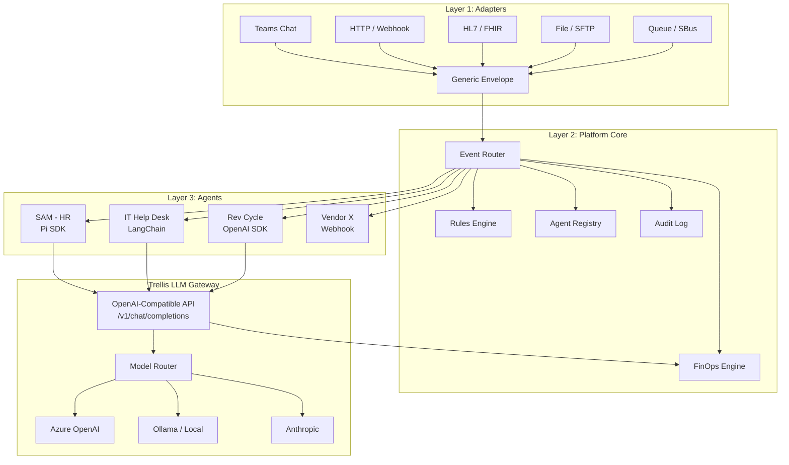

# Trellis — Enterprise AI Agent Orchestration Platform

> **"Kubernetes for AI agents."** Deploy, route, govern, and track costs for hundreds of AI agents across the enterprise — regardless of framework.

[](#tests)
[](#quick-start)
[](#)

---

## Why Trellis?

**For CIOs and enterprise architects** who need to answer: *"How many AI agents do we have, what are they doing, and what are they costing us?"*

| Challenge | Without Trellis | With Trellis |
|-----------|----------------|--------------|
| **Agent visibility** | Agents scattered across teams, no central registry | Every agent registered, health-checked, auditable |
| **Cost control** | Each agent calls LLMs directly — no budget caps, no tracking | Centralized LLM gateway with per-agent budgets, anomaly detection |
| **Governance** | No audit trail, no routing rules, manual oversight | Every event logged, rules-based routing, full trace chains |
| **Framework lock-in** | Tied to one SDK/framework | Framework-agnostic — Pi SDK, LangChain, OpenAI, or raw HTTP all work |
| **Scaling** | Adding agents = adding chaos | Adding agents = registering them in Trellis |

---

## Architecture



**Three layers, clean separation:**

1. **Adapters** — Dumb translators. Convert any input (Teams, HTTP, HL7, email) into a Generic Envelope. No logic, no state.
2. **Platform Core** — The brain. Routes envelopes via rules, registers agents, tracks costs, logs everything.
3. **Agents** — Do the actual work. Any framework. They call the Trellis LLM Gateway instead of providers directly — same OpenAI-compatible API, full cost visibility.

---

## Features by Slice

### ✅ Slice 1 — Platform Core
- Generic Envelope spec (source-agnostic event format)
- Event Router with priority-based rules engine
- Agent Registry with CRUD operations
- HTTP Adapter (simplified input → envelope)
- SQLite-backed audit log

### ✅ Slice 2 — LLM Gateway
- OpenAI-compatible `/v1/chat/completions` endpoint
- Multi-provider support: Ollama (local), OpenAI, Anthropic
- API key authentication (SHA-256 hashed, `trl_` prefixed)
- Per-request cost tracking with token counting
- Per-agent daily/monthly budget caps (429 on exceeded)

### ✅ Slice 3 — Agent Onboarding
- Agent types: HTTP, Webhook, Function, LLM (built-in)
- Auto-generated API keys on agent registration
- Background health check polling (60s interval)
- Manifest sync (pull agent capabilities from `/manifest`)
- Function agents (in-process Python callables)
- LLM agents (system prompt + model config, no external endpoint needed)

### ✅ Slice 4 — Enhanced Rules & Audit
- Advanced condition operators: `$gt`, `$lt`, `$gte`, `$lte`, `$exists`, `$regex`, `$not`, `$contains`, `$in`
- Fan-out routing (one event → multiple agents)
- Rule toggle (enable/disable without deleting)
- Rule test endpoint (dry-run matching)
- Rich audit events: envelope received, rule matched, agent dispatched, agent responded, errors
- Full trace chain visibility via `trace_id`

### ✅ Slice 5 — FinOps Engine
- Cost aggregation by agent, department, and trace
- Time-series cost data (hour/day/week granularity)
- Department drill-down (cost per agent within a department)
- Budget alerts at 80% threshold
- Cost anomaly detection (statistical deviation from rolling average)
- Complexity classifier (simple/medium/complex) for smart model routing
- Executive FinOps summary endpoint

### ✅ Slice 6 — Dashboard
- Next.js dashboard with real-time agent monitoring
- Cost visualization and FinOps charts
- Agent health status overview

---

## Quick Start

```bash
# Clone and install
git clone https://github.com/kraftwerkur/trellis.git
cd trellis
uv sync

# Initialize database
uv run alembic upgrade head

# Start the server
uv run -m trellis.main
```

**Interactive API docs:** [http://localhost:8100/docs](http://localhost:8100/docs)

### 5-Minute Demo

```bash
# 1. Register an agent
curl -s -X POST http://localhost:8100/api/agents \
  -H "Content-Type: application/json" \
  -d '{
    "agent_id": "mock-echo",
    "name": "Mock Echo Agent",
    "owner": "platform-team",
    "department": "IT",
    "framework": "mock",
    "endpoint": "http://localhost:8100/mock-agent/envelope",
    "health_endpoint": "http://localhost:8100/mock-agent/health"
  }' | python3 -m json.tool

# 2. Create a routing rule
curl -s -X POST http://localhost:8100/api/rules \
  -H "Content-Type: application/json" \
  -d '{
    "name": "Route all API events to mock",
    "priority": 100,
    "conditions": {"source_type": "api"},
    "actions": {"route_to": "mock-echo"}
  }' | python3 -m json.tool

# 3. Send a message through the platform
curl -s -X POST http://localhost:8100/api/adapter/http \
  -H "Content-Type: application/json" \
  -d '{"text": "Hello Trellis!", "sender_name": "Demo User"}' | python3 -m json.tool

# 4. Use the LLM Gateway (requires Ollama running locally)
# First get the API key from agent registration response, then:
curl -s -X POST http://localhost:8100/v1/chat/completions \
  -H "Authorization: Bearer trl_YOUR_KEY_HERE" \
  -H "Content-Type: application/json" \
  -d '{
    "model": "qwen3:8b",
    "messages": [{"role": "user", "content": "What is Trellis?"}]
  }' | python3 -m json.tool

# 5. Check costs and audit trail
curl -s http://localhost:8100/api/costs/summary | python3 -m json.tool
curl -s http://localhost:8100/api/finops/summary | python3 -m json.tool
curl -s http://localhost:8100/api/audit | python3 -m json.tool
```

---

## Docker Quickstart

Launch the full stack (API + Dashboard) with one command:

```bash
docker compose up -d --build
```

- **API:** [http://localhost:8000](http://localhost:8000) (Swagger docs at `/docs`)
- **Dashboard:** [http://localhost:3000](http://localhost:3000)

SQLite data is persisted in a Docker volume (`trellis-data`).

### Run the Demo in Docker

```bash
./examples/docker-demo.sh
```

This starts the stack, waits for health checks, and runs the multi-agent demo automatically.

### Stop

```bash
docker compose down          # Stop containers
docker compose down -v       # Stop and delete data volume
```

---

## Tests

```bash
uv sync
uv run pytest tests/ -v
```

**104 tests** covering all 6 slices: platform core, LLM gateway, agent onboarding, rules engine, audit trail, FinOps engine, and edge cases.

---

## Provider Configuration

```bash
# .env file
TRELLIS_OLLAMA_URL=http://localhost:11434/v1    # default, local
TRELLIS_OPENAI_API_KEY=sk-...                   # optional
TRELLIS_ANTHROPIC_API_KEY=sk-ant-...            # optional
```

The gateway falls back to Ollama if cloud providers aren't configured. Smart model routing automatically selects the right model based on request complexity.

---

## Project Structure

```
trellis/
├── main.py                  # FastAPI app + mock agent + lifespan
├── config.py                # Settings (pydantic-settings)
├── database.py              # Async SQLAlchemy engine
├── models/                  # SQLAlchemy ORM models
├── schemas/                 # Pydantic request/response schemas
├── api/                     # REST API routers
│   ├── agents.py            # Agent registry CRUD
│   ├── rules.py             # Rule CRUD + toggle + test
│   ├── router.py            # Event router + HTTP adapter
│   ├── keys.py              # API key management
│   ├── costs.py             # Cost queries + FinOps analytics
│   ├── finops.py            # Executive FinOps summary
│   ├── audit.py             # Audit event queries
│   └── health.py            # Health check
├── gateway/                 # LLM Gateway
│   ├── router.py            # /v1/chat/completions
│   ├── auth.py              # API key authentication
│   ├── model_router.py      # Model selection + complexity classifier
│   ├── cost_tracker.py      # Token counting + cost logging
│   ├── budget.py            # Budget cap enforcement + alerts
│   ├── finops.py            # Cost anomaly detection
│   └── providers/           # LLM backend providers
│       ├── ollama.py        # Ollama (local)
│       ├── openai.py        # OpenAI
│       └── anthropic.py     # Anthropic
├── core/                    # Business logic
│   ├── event_router.py      # Envelope → rules → dispatch → audit
│   ├── rule_engine.py       # JSON condition matching
│   ├── dispatcher.py        # HTTP/function/LLM dispatch
│   ├── health_checker.py    # Background health polling
│   └── audit.py             # Audit event emitter
├── adapters/
│   └── http_adapter.py      # Simplified input → envelope
├── functions/               # Built-in function agents
│   ├── echo.py
│   └── ticket_logger.py
├── dashboard/               # Next.js dashboard (Slice 6)
├── alembic/                 # Database migrations
└── tests/                   # Pytest test suite (104 tests)
```

---

## API Reference

See **[API.md](API.md)** for the complete API documentation with request/response examples.

---

## Competitive Landscape

Trellis occupies the **self-hosted, framework-agnostic** quadrant of a rapidly forming market. Here's how it compares:

| | **Trellis** | **Airia** | **AWS Bedrock AgentCore** | **ServiceNow AI Agents** | **UiPath Maestro** |
|--|-------------|-----------|--------------------------|--------------------------|-------------------|
| **Model** | Self-hosted, open | SaaS | Cloud (AWS) | SaaS (ServiceNow) | SaaS (UiPath) |
| **Framework lock-in** | None — Pi, LangChain, OpenAI, raw HTTP | Their platform | AWS ecosystem | ServiceNow ecosystem | UiPath ecosystem |
| **LLM Gateway** | ✅ OpenAI-compatible, multi-provider | ✅ Multi-model | ✅ AWS models | ❌ Built-in only | ❌ Limited |
| **FinOps / Cost tracking** | ✅ Per-agent budgets, anomaly detection | ✅ | Partial (CloudWatch) | ❌ | ❌ |
| **Audit trail** | ✅ Every event, full trace chains | ✅ | ✅ (CloudTrail) | ✅ | ✅ |
| **Governance** | Rules engine, routing | Dashboard + risk classification | IAM policies | Platform policies | BPMN workflows |
| **Healthcare / HIPAA** | You own the stack — deploy in your VPC | Marketed | BAA available | BAA available | Not primary |
| **Agent builder** | Config + code | No-code drag-and-drop | Code + console | Low-code | BPMN + RPA |
| **Data residency** | Your infrastructure | Their cloud | AWS regions | ServiceNow DCs | UiPath cloud |
| **Gartner recognition** | — | 2026 Emerging Tech | Magic Quadrant adjacent | ITSM leader | RPA leader |
| **Cost** | Free (build it) | Enterprise licensing | Pay-per-use | Per-seat | Per-bot |

### Why self-hosted matters for healthcare

Regulated industries (healthcare, finance, government) face a fundamental tension: **AI agents need access to sensitive data, but that data can't leave your perimeter.**

SaaS orchestration platforms require your agents — and their data flows — to route through vendor infrastructure. Even with BAAs and SOC2 reports, you're trusting a third party with PHI traversal.

Trellis runs entirely inside your network. The LLM Gateway can point to Azure OpenAI (with your own BAA) or local models via Ollama. Agent traffic never leaves your infrastructure. Audit logs stay in your databases. You don't need a vendor's permission to inspect, modify, or shut down any part of the system.

**The trade-off is real:** You build and maintain it. There's no support contract, no drag-and-drop agent builder, no vendor onboarding team. Trellis is for organizations with engineering capacity that consider infrastructure control a feature, not a burden.

### Where Trellis is NOT the right choice

- **You want no-code agent building** → Airia, ServiceNow
- **You're all-in on AWS** → Bedrock AgentCore
- **You need RPA + AI orchestration** → UiPath Maestro
- **You don't have engineering staff to maintain it** → Any SaaS option

---

## Roadmap

- [ ] Teams adapter (Bot Framework)
- [ ] HL7/FHIR adapter (Epic integration)
- [ ] Agent-to-agent delegation chains
- [ ] Streaming support for LLM Gateway
- [ ] Role-based access control (RBAC)
- [ ] Azure deployment (AKS + Managed Identity)
