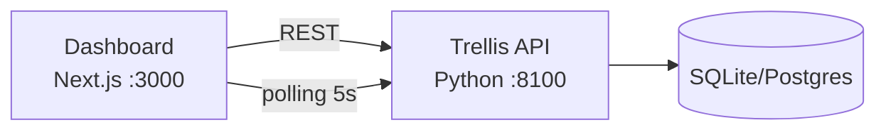

# Trellis Dashboard

Command center for the Trellis AI Agent Orchestration Platform.

## Stack

- **Next.js 15** (App Router)
- **TypeScript**
- **Tailwind CSS** + **shadcn/ui**
- **Recharts** for charts
- **TanStack Table** for data tables
- **Lucide React** for icons

## Setup

```bash
cd dashboard
npm install
npm run dev  # http://localhost:3000
```

### Environment

| Variable | Default | Description |
|----------|---------|-------------|
| `NEXT_PUBLIC_TRELLIS_API_URL` | `http://localhost:8100` | Trellis API base URL |

## Pages

| Route | Description |
|-------|-------------|
| `/` | Overview — agent stats, activity feed, costs, envelopes |
| `/agents` | Agent registry with status, click → detail view |
| `/agents/[id]` | Agent detail — metadata, costs chart, audit events, LLM config |
| `/audit` | Filterable audit log with trace chain visualization |
| `/rules` | Routing rules — create, toggle, test |
| `/costs` | FinOps — per-agent bar chart, department pie, time series |

## Architecture



The dashboard is a **read-heavy client** that polls the Trellis API. It does not maintain its own state beyond what's in the URL. All data flows from the API.

## Design

Dark ops aesthetic — near-black background (#0a0a0a), cyan/teal accents, glowing status indicators, monospace for IDs and traces. Built to impress at the CIO level.
